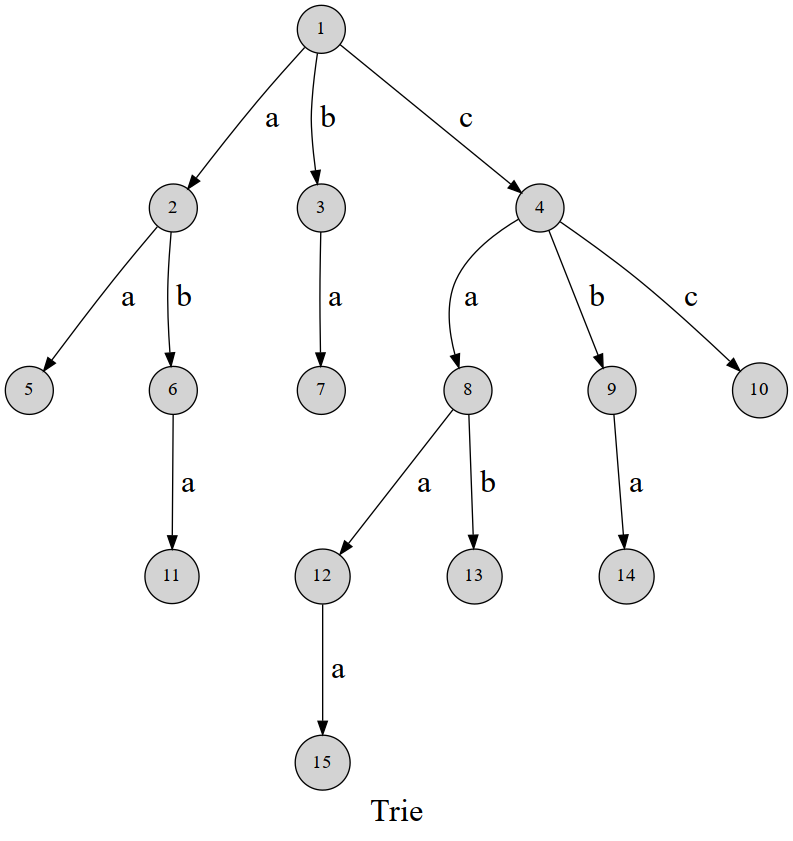

#  1 图论

## 1.1 链式前向星

```c++
// maxn : 结点最大个数
// maxm : 边的最多个数
struct edge {
    int u,v,w,next;
}e[maxm];
int head[maxn];// head[i] : 以结点i为起点的第一条边的编号
int cnt;//编号变量

void addedge(int x,int y,int z){
    e[cnt].u=x;
    e[cnt].v=y;
    e[cnt].w=z;
    e[cnt].next=head[x];
    head[x]=cnt++;
}

memset(head,-1,sizeof(head));//head数组一般初始化为-1

// << a b c : 结点a与b之间有长为c的路径
addedge(a,b,c);
addedge(b,a,c);
// << end 
```

尽量将边的编号从0开始计，因为如若此法，边i的反向边的编号可用i^1表示。

## 1.2 最短路径

---

### 1.2.1 Floyd算法

---

#### 1.2.1.1 Floyd算法求解最短路径

---

Floyd算法的时间复杂度为**O(N³)**，其中N为图结点的个数。

```c++
// << n : 图结点个数

int dis[maxn][maxn];//dis[i][j]表示从i结点到j结点的最短路径的值

memset(dis,0x3f,sizeof(dis));//初始化为无穷大

// << a b c : 结点a与b之间有长为c的路径
dis[a][b]=c;
dis[b][a]=c;
dis[i][i]=0;
// << end

void handle(){
    for(int k=1;k<=n;k++){
        for(int i=1;i<=n;i++){
            for(int j=1;j<=n;j++){
                if(dis[i][j] > dis[i][k] + dis[k][j]){
                    dis[i][j] = dis[i][k] + dis[k][j];
                }
            }
        }
    }
}
```

#### 1.2.1.2 Floyd算法求最短路径个数

---

记`cnt[i][j]`表示从结点`i`到结点`j`的最短路径的个数。

`cnt`数组初始化为0，当读入图时，若有有向边`<u,v>`，那么初始化`cnt[u][v] = 1`。

在Floyd过程即可求`cnt`数组。

```c++
for(int k=1;k<=n;k++){
    for(int i=1;i<=n;i++){
        for(int j=1;j<=n;j++){
            if(dis[i][j] > dis[i][k] + dis[k][j]){
                dis[i][j] = dis[i][k] + dis[k][j];
                cnt[i][j] = cnt[i][k] * cnt[k][j];
            }
            else if(dis[i][j] == dis[i][k] + dis[k][j]){
                cnt[i][j] += cnt[i][k] * cnt[k][j];
            }
        }
    }
}
```

#### 1.2.1.3 Floyd算法求最小环

---

定义`W[u][v]`表示边集，若有有向边`<u,v> = w`，那么`W[u][v] = w`。否则`W[u][v] = INF`。

在求解完毕最短路径后，`dis`值已知。

枚举结点`i`，对于每个结点`i`,枚举其一条边`<i,k>`，显然`W[i][k] + dis[k][i]`构成一个最小环路。这些最小环路中取最小值即为最小环长度。

```c++
int res = INF;
for(int i=1;i<=n;i++){
    for(int k=1;k<=n;k++){
        if(W[i][k] != INF){
            res = min(res,W[i][k] + dis[k][i]);
        }
    }
}
// cout << res
```

若求图中最小环的个数，为保证不重不漏地计算，应在Floyd过程中处理。

记`res`为最小环的长度，`ans`为最小环的个数。

```c++
void floyd(){
    LL res = LONGINF;
    LL ans = 0;
    for(int k=1;k<=n;k++){
        for(int i=1;i<=n;i++){
            for(int j=1;j<=n;j++){
                if(dis[i][j] > dis[i][k] + dis[k][j]){
                    dis[i][j] = dis[i][k] + dis[k][j];
                    cnt[i][j] = cnt[i][k] * cnt[k][j];
                }
                else if(dis[i][j] == dis[i][k] + dis[k][j]){
                    cnt[i][j] += cnt[i][k] * cnt[k][j];
                }
            }
        }
        // 对于一个环，只有枚举到标号最大的点的时候才把方案计入答案。当最外层循环枚举到 k 时，dis[i][j] 表示除了 i, j，其余点 ≤ k 的最短距离
        for(int i=1;i<k;i++){
            if(W[k][i] != INF){
                if(res > dis[i][k] + w[k][i]){
                    res = dis[i][k] + w[k][i];
                    ans = cnt[i][k];
                }
                else if(res == dis[i][k] + w[k][i]){
                    ans += cnt[i][k];
                }
            }
        }
    }
}
```

### 1.2.2 堆优化Dijkstra算法

---

加堆优化的Dijkstra算法的时间复杂度稳定为**O(MlogN)**，其中M为边的个数，N为结点的个数，用于处理**单源最短路径**。

Dijkstra算法无法解决带**负权边**的图。

```c++
// n : 图结点的个数
// s : 图的源点
int dis[maxn];//dis[i] : 从源点到结点i的最短路径的值
bool vis[maxn];// vis[i] : 结点i是否被处理过

struct infodis {
    int idx,dist;
};

struct cmp {
    bool operator()(infodis a,infodis b){
        return a.dist>b.dist;
    }
};

priority_queue<infodis,vector<infodis>,cmp> train;//建立优先队列train

void handle(){
    memset(dis,0x3f,sizeof(dis));//初始化为无穷大
    
    dis[s]=0;
    train.push({s,dis[s]});
    
    
    while(!train.empty()){
        int idx = train.top().idx;
        train.pop();
        
        if(vis[idx]) continue;
        vis[idx]=true;
        
        for(int i=head[idx];~i;i=e[i].next){
            int v=e[i].v;
            if(dis[v] > dis[idx] + e[i].w){
                dis[v] = dis[idx] + e[i].w;
                train.push({v,dis[v]});
            }
        }
    }
}
```

### 1.2.3 Johnson算法

---

Johnson算法常用于处理**多源最短路径**，基于堆优化Dijkstra算法的Johnson算法的时间复杂度为**O(NMlogN)**，显著优于Floyd算法。

此算法可以解决带负权边的图，基于reweight思想。

Johnson算法有以下步骤：

1.新建一个新的结点root。指向所有结点，边权设置为0。

2.在新图下进行一次以root为源点的单源最短路径算法，得到从root到任意结点x的最短路径值，记为**h(x)**。

3.废弃root结点以及其引出的所有边权为0的边(回归原图)。

4.遍历所有边**(u,v)**，将其边权进行reweight，有 **w'(u,v) = w(u,v) + h(u) - h(v)**。执行完后，所有的边权均为正值。

5.在新边权图下对每个结点执行Dijkstra算法,得到每个结点对在新图下的最短路径**dis\[u][v]**。

6.任意结点对原本的最短路径**real_dis\[u][v]**为:  **real_dis\[u][v] = dis\[u][v] + h[v] - h[u]**。 

### 1.2.4 SPFA算法

---

SPFA算法的时间复杂度为**O(kM)**，k与图的稠密程度有关，图越稠密，k越趋近于N，直至退化成**O(NM)**。

SPFA算法无法解决带**负权回路**的图。

```c++
// n : 图结点的个数
// s : 图的源点

int dis[maxn];//dis[i] : 从源点到结点i的最短路径的值
deque<int>train;//队列
bool intrain[maxn];//intrain[i] : 结点i是否在队列train中


void handle(){
    memset(dis,0x3f,sizeof(dis));//初始化为无穷大
    dis[s]=0;
    
    train.push_back(s);
    intrain[s]=true;//将源点加入队列
    
    while(!train.empty()){
        int idx=train.front();
        train.pop_front();
        intrain[idx]=false;//弹出队首
        
        for(int i=head[idx];~i;i=e[i].next){
            int v=e[i].v;
            if(dis[v] > dis[idx] + e[i].w){
                dis[v] = dis[idx] + e[i].w;
                if(!intrain[v]){
                    train.push_back(v);
                    intrain[v]=true;
                }
            }
        }
    }
    
}
```

SPFA的**SLF优化**具有一定效果，在将结点加入队列时，判断该结点的dis值和队首的dis值的大小关系，如果比队首的dis值要小，那么将该结点加入队首，否则正常加入队尾，见下：

```c++
// n : 图结点的个数
// s : 图的源点

int dis[maxn];//dis[i] : 从源点到结点i的最短路径的值
deque<int>train;//队列
bool intrain[maxn];//intrain[i] : 结点i是否在队列train中


void handle(){
    memset(dis,0x3f,sizeof(dis));//初始化为无穷大
    dis[s]=0;
    
    train.push_back(s);
    intrain[s]=true;//将源点加入队列
    
    while(!train.empty()){
        int idx=train.front();
        train.pop_front();
        intrain[idx]=false;//弹出队首
        
        for(int i=head[idx];~i;i=e[i].next){
            int v=e[i].v;
            if(dis[v] > dis[idx] + e[i].w){
                dis[v] = dis[idx] + e[i].w;
                if(!intrain[v]){
                    if(!train.empty() && dis[v] < dis[train.front()]){//SLF: 如果dis[v]值比队首要小，则将其加入队首
                        train.push_front(v);
                    }
                    else train.push_back(v);//否则正常加入队尾
                    intrain[v]=true;
                }
            }
        }
    }
    
}
```

## 1.3 图的负环

用**SPFA算法**判断图是否存在负环。SPFA算法每个结点最多被松弛N-1次，如果某个结点被松弛了超过N-1次，则表明图中存在负环。

```c++
int dis[maxn];
deque<int>train;
bool intrain[maxn];

int chval[maxn];//结点更新次数

void handle(){
    memset(dis,0x3f,sizeof(dis));
    dis[s]=0;
    train.push_back(s);
    intrain[s]=true;

    while(!train.empty()){
        int next_index=train.front();
        train.pop_front();
        intrain[next_index]=false;

        int i;
        for(i=head[next_index];i!=-1;i=e[i].next){
            int v=e[i].v;
            if(dis[v]>dis[next_index]+e[i].w){
                dis[v]=dis[next_index]+e[i].w;
                
 				chval[v]++;
                if(chval[v]>=n){//结点最多只会被更新n-1次
                    //存在负环
                }
                
                if(!intrain[v]){
                    train.push_back(v);
                    intrain[v]=true;
                }
            }
        }
    }
}

```

## 1.4 欧拉回路

```c++
int indgree[maxn];// indgree[i] : 结点i的入度 

int fa[maxn];// fa[i] : 结点i所在并查集的根结点
int findx(int x){
    int t=x;
    while(t!=fa[t])
        t=fa[t];
    int i=x,j;
    while(i!=t){
        j=fa[i];
        fa[i]=t;
        i=j;
    }
    return t;
}

deque<int>train;//模拟递归栈
bool vis[maxn];

int ans[maxn];//最终的欧拉回路节点顺序
int tail;

bool prep(){
    int i,k=0;
    for(i=1;i<=n;i++){
        if(fa[i]==i){
            k++;
            if(k>1){
                return false;//原图不是一个连通块,肯定不存在欧拉回路
            }
        }
        if(indgree[i]&1){//存在奇点，则原图肯定不存在欧拉回路
            return false;
        }
    }
    return true;
}

void handle(){
    if(!prep()) return ;//判断是否为欧拉图
    train.push_back(1);

    while(!train.empty()){
        int next_index=train.back();
        int cur=head[next_index];
        while(cur!=-1 and vis[cur]) cur=e[cur].next;
        if(cur!=-1){
            train.push_back(e[cur].v);
            head[next_index]=e[cur].next;
            vis[cur]=vis[cur^1]=true;
        }
        else {
            train.pop_back();
            ans[++tail]=next_index;
        }
    }
}
```

## 1.5 最小生成树

---

### 1.5.1 kruskal算法

---

kruskal算法的时间复杂度为**O(MlogM)**，M为边的个数。

```c++
int fa[maxn];// fa[i] : 结点i所在的并查集的根

int findx(int x){//并查集找根函数
    int t=x;
    while(t!=fa[t])
        t=fa[t];

    int i=x,j;
    while(i!=t){
        j=fa[i];
        fa[i]=t;
        i=j;
    }
    return t;
}

int sumw;// sumw : 最小生成树的边权和

bool cmp(edge a,edge b){
    return a.w<b.w;
}

void prep(){
    int i;
    for(i=1;i<=n;i++){
        fa[i]=i;//并查集初始化
    }
    sort(e+1,e+cnt+1,cmp);//将边权升序排序
}


void handle(){
    int i,k=0;

    for(i=1;i<=cnt;i++){
        int f1=findx(e[i].u);
        int f2=findx(e[i].v);
        if(f1!=f2){
            fa[f1]=f2;
            k++;
            sumw+=e[i].w;

            if(k==n-1)
                return ;
        }
    }
}

```

### 1.5.2 堆优化prim算法

---

加入堆优化的prim算法的时间复杂度为**O(NlogN)**，其中N为结点的个数。

prim算法在处理**网格图**等边稠密的图时时间较kruskal算法优秀。

```c++
int dis[maxn];

int ans;

struct info {
    int num,idx;
};

struct cmp {
    bool operator ()(info a,info b){
        return a.num>b.num;
    }
};

priority_queue<info,vector<info>,cmp>train;
bool vis[maxn];

void prim(int s){//s可为任意结点
    memset(dis,0x3f,sizeof(dis));
    dis[s]=0;

    train.push({dis[s],s});

    while(!train.empty()){
        int next_index=train.top().idx;
        train.pop();

        if(vis[next_index])
            continue;
        vis[next_index]=true;

        ans+=dis[next_index];

        int i;
        for(i=head[next_index];i!=-1;i=e[i].next){
            int v=e[i].v;

            if(dis[v]>e[i].w){
                dis[v]=e[i].w;
                train.push({dis[v],v});
            }
        }
    }
}

```

## 1.6 图的连通性

### 1.6.1 无向图的割点

---

tarjan算法求解图的割点的时间复杂度为**O(N+M)**。

```c++
int dfn[maxn],low[maxn];
int tmp,root;
bool legal[maxn]; // 记录结点是否是割点

void tarjan(int u){
    dfn[u] = low[u] = ++tmp;
    int soncnt = 0; //搜索树的根结点特殊处理
    for(auto v : G[u]){
        if(!dfn[v]){
            tarjan(v);
            low[u] = min(low[u],low[v]);
            if(root != u and low[v] >= dfn[u]){
                legal[u] = true;
            }
            if(u == root) soncnt++;
        }
        else {
            low[u] = min(low[u],dfn[v]);
        }
    }
    if(u == root and soncnt > 1 ) legal[u] = true;
}

// main
for(int i=1;i<=n;i++){
    if(!dfn[i]){//tarjan图可能不连通，分别求每一个连通分量的答案
        tmp = 0;
        root = i;
        tarjan(i); 
    }
}
// end main
```

### 1.6.2 无向图的割边

---

tarjan算法求解图的割边的时间复杂度为**O(N+M)**。

因为割边需要标记边的信息，所以存图方式更适合使用`链式前向星`。

```c++
int dfn[maxn];
int low[maxn];
bool cut[maxm]; // cut[i] : 边i是否是割边
int root=1;
int tmp=0;
void tarjan(int u,int in_edge){ // in_edge表示从哪条边来的，注意不能记录前驱结点pre，应该记录前驱边.如果记录的是前驱结点，那么如果有重边就会出错
    low[u] = dfn[u] = ++tmp;
    for(int i=head[u];i!=-1;i=e[i].next){
        int v=e[i].v;
        if(!dfn[v]){
            tarjan(v,u);
            low[u]=min(low[u],low[v]);
            if(low[v] > dfn[u]){
                cut[i] = cut[i^1] = true;//若边编号从0开始计数，则边i的反向边的编号即为i^1
            }
        }
        else if(i != (in_edge ^ 1)){ //不是反向边
            low[u]=min(low[u],dfn[v]);
        }
    }
}

// === main
for(int i=1;i<=n;i++){
    if(!dfn[i]) tarjan(i,0);
}
// ========
```

### 1.6.3 有向图强连通分量缩点(SCC)

---

强连通分量使用于**有向图**。若某些点可以相互到达，那么它们归属于一个连通分量，连通分量的极大集即为强连通分量。强连通分量中的任意两个结点可以互相到达。

使用tarjan算法对每一个强连通分量中的结点染相同的颜色，时间复杂度为**O(N+M)**。

```c++
int n,m;// 结点数目为n，边的个数为m
vi G[maxn];
stack<int>stk; //栈
bool instk[maxn]; //判断结点是否在栈内
int low[maxn],dfn[maxn],tmp;
int idx;
int scc[maxn]; // 记录每个结点所属强连通分量的编号
void tarjan(int u){
    dfn[u] = low[u] = ++tmp;
    stk.push(u);
    instk[u] = true;

    for(auto v : G[u]){
        if(!dfn[v]){
            tarjan(v);
            low[u] = min(low[u],low[v]);
        }
        else if(instk[v]){
            low[u] = min(low[u],dfn[v]);
        }
    }

    if(low[u] == dfn[u]){
        ++idx; //  找到一个强连通分量，编号为idx
        while(1){
            int ver = stk.top();
            stk.pop();
            instk[ver] = false;
            scc[ver] = idx;
            if(ver == u) break;
        }
    }
}

// === main
for(int i=1;i<=n;i++){
	if(!dfn[i]){
    	tarjan(i);
    }
}
// ========
```

利用tarjan算法求出SCC后，可以在`O(N+M)`的时间内建立缩点图，如下：

```c++
int scc[maxn];
vector<int>G[maxn]; //原图
vector<int>newG[maxn];// 新建的缩点图
int val[maxn]; //原结点的点权
int newVal[maxn]; // 缩点图结点的点权
for(int i=1;i<=n;i++){
    newVal[ scc[i] ] += val[i]; //如果结点具有点权,那么显然其对缩的点的点权有贡献，具体问题具体分析。
    for(auto v : G[i]){
        if(scc[i] != scc[v]){
            //如果i -> v 且i和v属于不同的强连通分量，显然缩点后有一条从i所属SCC指向v所属SCC的边
            newG[ scc[i] ].pb(scc[v]);
        }
    }
}
```

注意：很多情况下，缩点后建的图都具有重边，因为`scc[x]`可能有多个指向`scc[y]`的边。

缩点后的图具有以下性质：

1. 缩点图一定是一个有向无环图(DAG)。
2. 每个缩点会对应一个编号(scc数组)，且在缩点图中如果u能到达v，那么u一定大于v。即缩点的点的编号一定是拓扑序的逆序。(x -> y -> z,则x > y > z)

### 1.6.4 无向图边双连通分量缩点(eDCC)

---

无向图的边双连通分量中是一个不包含割边的极大连通块。在原无向图中将所有的割边删除，剩下的每一个联通块都是一个边双连通分量。

可以在`O(N+M)`的时间复杂度下求出无向图的eDCC：

```c++
int n,m;
struct edge {
    int u,v,next;
}e[maxm << 1];
bool cut[maxm << 1];
int head[maxn];
int cnt = 1;
void addedge(int x,int y){
    e[++cnt].u = x;
    e[cnt].v = y;
    e[cnt].next = head[x];
    head[x] = cnt;
}

int dfn[maxn],low[maxn],tmp;
stack<int>stk;
int dcc[maxn],idx; // dcc[i] 表示结点i对应双连通分量的编号

void tarjan(int u,int in_edge){
    low[u] = dfn[u] = ++tmp;
    stk.push(u);

    for(int i=head[u];i!=-1;i=e[i].next){
        int v = e[i].v;
        if(!dfn[v]){
            tarjan(v,i);
            low[u] = min(low[u],low[v]);
            if(low[v] > dfn[u]){
                cut[i] = cut[i ^ 1] = true;
            }
        }
        else if(i != (in_edge ^ 1)){
            low[u] = min(low[u],dfn[v]);
        }
    }

    if(low[u] == dfn[u]){
        ++idx;
        while(1){
            int ver = stk.top();
            stk.pop();
            dcc[ver] = idx;
            if(ver == u) break;
        }
    }
}

// ==== main
for(int i=1;i<=n;i++){
    if(!dfn[i]){
    	tarjan(i,0);
    }
}
// =========
```

利用tarjan算法求出dcc数组后可建缩点树，每一个双连通分量抽象成一个结点。由于将原图的割边删去可得到所有eDCC，所以缩点图的边一定对应原图的割边，在tarjan算法中cut数组已记录所有的割边，可以此在`O(M)`的时间复杂度下建缩点树。

注意：边双连通分量缩点后只会形成树，不会形成图结构即不会含有环。

```c++
vector<int>newG[maxn]; // 节省空间可用 newG[idx+1]，因为缩点的编号范围为1 ~ idx
for(int i=1;i<=m<<1;i++){ // 逐个扫描每一条边，处理每一个割边，也可以在tarjan算法过程中标记割边时提前将所有割边装入一个容器
    if(cut[i]){ // 当前边是割边
        int u = e[i].u;
        int v = e[i].v; //找到边连接的两个结点
        newG[ dcc[u] ].pb(dcc[v]); //在缩点树中连边,只连接u->v的即可，因为v->u的边可在i的反向边中建立，不会出现重边。
    }
}
```

### 1.6.5 无向图点双连通分量缩点(vDCC)

---

无向图的所有点双连通分量不含有割点。在边双连通分量中，将原图删去割点即得到所有的边双连通分量；而点双连通分量情形稍复杂，割点会裂点到关联的点双连通分量中。如下图，结点1和5是割点，它们会裂点到相关联的点双连通分量中。这意味着，割点会存在多个点双连通分量中，而非割点只会存在于某一个点双连通分量中。


可以在`O(N+M)`的时间复杂度下求出无向图的所有vDCC，如下：

```c++
int n,m;
vi G[maxn];

bool cut[maxn]; // 标记割点
int dfn[maxn],low[maxn],tmp;
stack<int>stk;
vi dcc[maxn]; // 存储所有的vDCC
int idx;
int root;

void tarjan(int u){
    low[u] = dfn[u] = ++tmp;
    stk.push(u);

    if(!G[u].size()){ // 特殊判断孤立点，孤立点显然是一个vDCC
        dcc[++idx].pb(u);
        return ;
    }

    int son = 0;
    for(auto v : G[u]){
        if(!dfn[v]){
            tarjan(v);
            low[u] = min(low[u],low[v]);
            if(low[v] >= dfn[u]){
                son++;
                if(u != root or son > 1){
                    cut[u] = true;
                }
                idx++;
                while(1){
                    int ver = stk.top();
                    stk.pop();
                    dcc[idx].pb(ver);
                    if(ver == v) break; // 与求eDCC不同，因为割点会属于多个vDCC，在这里不能将u结点弹出，u结点应该保留在栈中
                }
                dcc[idx].pb(u); // 添加u结点到这个vDCC中
            }
        }
        else {
            low[u] = min(low[u],dfn[v]);
        }
    }
}

void SOLVE(){
    cin >> n >> m;
    for(int i=1;i<=m;i++){
        int x,y;
        cin >> x >> y;
        if(x == y) continue; // 注意：需要排除掉自环，否则会影响答案
        G[x].pb(y);
        G[y].pb(x);
    }

    for(int i=1;i<=n;i++){
        if(!dfn[i]){
            root = i; // 记录当前搜索树的根结点
            tarjan(i);
        }
    }
}
```

点双连通分量的缩点也稍有区别。不仅所有点双连通分量缩成一个点，还需要同相应的割点连边。如下图所示，四个vDCC分别缩点为编号1,2,3,4的结点，原有的割点1和5变为编号为5和6的结点连接所有缩点，形成缩点树。


可以在`O(N)`的时间复杂度下通过vDCC建立缩点树，如下：

```c++
vector<int>newG[maxn]; // 缩点树
vector<int>dcc[maxn]; // 记录的所有vDCC
int idx; // vDCC的编号池
bool cut[maxn]; // 记录结点是否是割点
int id[maxn]; // 记录结点在缩点树中的新编号，只有割点才存在这个新编号，非割点已经被缩点了
// ============
int temp = idx;
for(int i=1;i<=n;i++){
    if(cut[i]) id[i] = ++temp; // 给所有的割点新的编号，原来有idx个vDCC，显然割点编号从idx+1开始
}
for(int i=1;i<=idx;i++){
    for(auto ver : dcc[i]){ // 扫描所有vDCC的结点
        if(cut[ver]){ // 如果当前结点是割点，说明当前vDCC和这个割点有连边，注意在缩点树中该割点有了新的编号(id数组中)
            newG[i].pb( id[ver] ); //连无向边
            newG[ id[ver] ].pb(i);
        }
    }
}
// ============
```

## 1.7 二分图

---

**二分图**是一种特殊的图，二分图存在一种黑白染色方式，使某结点的相邻结点均与自己颜色不同。

可以用**DFS染色法**判定图是否是二分图，时间复杂度为**O(N+M)**。

```c++
int col[maxn]; // col[i] : 结点i的染色信息
bool legal=true;//判断是否为二分图

int num[3];//染色节点的数量

void prep(){
    int i;
    memset(col,-1,sizeof(col)); // 染色数组初始化
    col[0]=0; // 边界
    for(i=1;i<=n;i++){
        if(!legal){
            printf("Impossible");
            return ;
        }
        if(col[i]==-1){
            dfs(i,0); // 执行DFS染色
            ans+=min(num[0],num[1]);
            memset(num,0,sizeof(num));
        }
    }
}

void dfs(int u,int pre){
    if(legal==false) return ;
    col[u]=(col[pre]^1); // 当前结点的颜色一定与前驱结点不同

    num[col[u]]++;
    for(int i=head[u];i!=-1;i=e[i].next){
        int v=e[i].v;
        if(v!=pre){
            if(col[v]!=-1 ){
                if(col[v]==col[u]){
                    legal=false;
                    return ;
                }
            }
            else {
                dfs(v,u);
            }
        }
    }
}
```

## 1.8 拓扑排序

拓扑排序适用于有向图。时间复杂度为**O(N+M)**。

```c++
int indgree[maxn];// indgree[i] : 结点i的入度

void read(){
    memset(head,-1,sizeof(head));
    int i;
    for(i=1;i<=m;i++){
        int a,b,c;
        scanf("%d%d%d",&a,&b,&c);
        addedge(a,b,c);
        indgree[b]++; // b的入度增加
    }
}

int tail;

deque<int>train;

void topo(){
    int i;
    for(i=1;i<=n;i++){
        if(!indgree[i]){//入度为0，压入队列中
            train.push_back(i);
        }
    }

    while(!train.empty()){
        int next_index=train.front();
        train.pop_front();

        ord[++tail]=next_index;

        for(i=head[next_index];i!=-1;i=e[i].next){
            int v=e[i].v;
            indgree[v]--;//相邻结点的入度减一

            if(!indgree[v]){//若该结点的入度为0，则将其加入队列
                train.push_back(v);
            }
        }
    }
}
```

## 1.9 Kruskal重构树

---

Kruskal重构树用于处理图上两结点路径的最大/最小边权问题。基于`1.5.1`的Kruskal最小生成树算法。

首先利用Kruskal算法找到原图的最小生成树，这需要我们维护边集信息。

```c++
struct edge {
    int u,v,w;
    bool operator < (const edge & o) const {
        return w < o.w;
    }
}e[maxm];
```

图的最小生成树有`n`个结点，`n-1`条边。我们在此基础上建立Kruskal重构树，Kruskal重构树在`n`个结点的基础上，将`n-1`条边作为新结点合并，且其点权就是原来的边权，这意味着重构树的结点个数为`2n - 1`。

合并通过并查集实现，定义`dsu[maxn << 1]`为并查集数组。

```c++
int dsu[maxn << 1]; //并查集
int val[maxn << 1];//Kruskal重构树结点的点权，只有新建结点有点权，代表原来的边权
vector<int>G[maxn << 1]; // Kruskal重构树
int cnt = n;//新结点的编号，新结点编号显然从 n + 1 开始
for(int i=1;i<=m;i++){ // 枚举边，边是升序排序好的
    int u = e[i].u;
    int v = e[i].v;
    
    int fu = fnd(u),fv = fnd(v); // 找到u,v所在的集合
    if(fu != fv){ // 如果它们不是同一个集合，则将它们合并。利用新建结点将它们连接，具体地，新建结点的点权就是当前边的边权，新建结点作为根，其左右孩子分别为fu和fv
        val[ ++cnt ] = e[i].w; // 点权更新
        dsu[fu] = dsu[fv] = dsu[cnt] = cnt; // 合并集合，新建结点为根，fu，fv分别为其左右孩子
        G[cnt].push_back(fu);
        G[cnt].push_back(fv); // 构建重构树
    }
}
```

Kruskal重构树构建的时间复杂度是`O(n)`。可以分析出重构树有以下性质。

1. Kruskal重构树一定是一个`二叉树`。叶子结点一定是原来的结点(不具有点权的,编号为`1 ~ n`)，非叶子结点一定是新建的结点(具有点权的`n + 1 ~ 2n - 1`)，且根结点编号一定是`2n - 1`。
2. (针对最小生成树构建的)父亲的点权一定大于或等于孩子的点权(特殊地，叶子结点不具有点权)。两个叶子结点的`LCA`结点的点权即为原最小生成树上两结点路径之间的最大边权。
3. 非叶子结点即新建结点一定是有两个孩子的，因为新结点的产生即连接了`fu`和`fv`。

## 1.10 2-SAT

---

在2-sat问题中会得到若干个关系式形如：

p∨q，也就是p||q，p或q，p为true或者q为true

而我们离散数学中学逻辑关系式中有这么一个转化关系：

`p∨q == ¬q → p` 

也就是:

`p || q ==> (!q) -> p`

根据p和q 的真假性我们可以得到下列表格

对于一个规模为`n`的2SAT问题，我们设结点i代表i为`false`,i+n代表i为`true`。我们按照箭头建有向边，构成一个有向图。每一条有向边， u->v 表示如果选择u，那么v也必须选择，不然就违反了关系式。因此我们对这张图求强连通分量。那么，对于这张图中的每个强连通分量中的点一定要么同时选，要么同时不选。

`判断无解`：如果i和i+n在同一个强连通分量中，那么明显无解，因为二者对立不可能同时存在。（i既为true又为false显然不存在）

这张拓扑图中，如果u可以到达v，那么u选择则v也必须选择。tarjan算法式地走一遍就是有向图的拓扑序，因为是用的栈存的节点，所以是拓扑逆序（对于每一个强连通分量都是一个拓扑逆序，块间也是拓扑序，因为每一块之间至多只有一条边，多了就连一块了）。
`选择方案`：对于每一个点来说，在x和x+n中选择拓扑序较大的点。这样就可以避免产生冲突了。并且这种方法一定可以构造出
解。

时间复杂度为：`O(N+M)`。

```c++
typedef long long ll;
const int N = 2000007, M = 5000007, INF = 0x3f3f3f3f;

int n, m;
int dfn[N], low[N], num;
bool vis[N], ins[N];
int a[N], scc_cnt;
int scc_id[N], color[N]; //记录结点所在的强连通分量的编号
int stk[N], top;
int ver[M], nex[M], head[N], tot;

void add(int x, int y){
    ver[tot] = y;
    nex[tot] = head[x];
    head[x] = tot  ;
}

void tarjan(int x)
{
    dfn[x] = low[x] = ++num;
    stk[++top] = x;
    ins[x] = true;
    for(int i = head[x]; ~i; i = nex[i]){
        int y = ver[i];
        if(!dfn[y]){
            tarjan(y);
            low[x] = min(low[x],low[y]);
       }
        else if(ins[y])
            low[x] = min(low[x],dfn[y]);
   }
    if(low[x] == dfn[x]){
        int y;
        ++scc_cnt;
        do{
            y = stk[top--];
            ins[y] = false;
            scc_id[y] = scc_cnt;
            color[y] = scc_cnt;
       }while(x != y);
   }
}

int main()
{
    memset(head, -1, sizeof head);
    scanf("%d%d", &n, &m);
    for(int i = 1; i<=m;++i){
        int p, q ,c ,d;
        scanf("%d%d%d%d", &p, &c, &q, &d);
        
        //根据范式建图
        if(c && d){
            add(p, q + n);
            add(q, p + n);
       	}
        else if(!c && d){
            add(p + n, q + n);
            add(q, p);
       	}
        else if(c && !d){
            add(p, q);
            add(q + n, p + n);
        }
        else if(!c && !d){
            add(p + n, q);
            add(q + n, p);
       	}
   	}
    for(int i = 1; i <= 2 * n; ++i){ //常规求强连通分量，注意规模是2n
        if(!dfn[i]) tarjan(i);
   	}
    
    for(int i = 1 ;i<=n;++i) {
        if(color[i] == color[i + n]){ //i既为真又为假，无解
            puts("IMPOSSIBLE");
            return 0;
       	}
   	}
    
    // 选择方案，保证不冲突是i和i+n哪个强连通分量编号小选哪个值
    //谁小选谁，这里i + n表示的是x (true)
    for(int i = 1; i<=n;++i)
        printf("%d ", (color[i] > color[i + n]));
    return 0;
}
```

## 1.11 网络流

### 1.11.1 dinic算法求网络最大流

---

在有向图上给定源点 $s$ 和汇点 $t$，求从源点到汇点的最大流量。

假定图的结点数目为 $n$ ，边的数目为 $m$ ，使用**dinic算法**的时间复杂度为$O(n^2m)$​。 

dinic算法的整体思路如下：

1. 构建图时对每一条边构建一条反向边，初始化其容量(权值)为0。
2. 对图执行bfs得到其分层图。
3. 在分层图上进行dfs，得到当前可行的流量值，对于每条边，如果其有流量f，则其边容量(权值)减去f，其反向边容量(权值)加上f。
4. 继续2操作，直到bfs搜索分层图无法达到汇点t。
5. 每一次dfs得到的流量值加起来就是最大流。

由上整体思路发现，需要维护边及其反向边的权值，故存图应用链式前向星。

对dinic算法有三条可行优化：

1. 当前弧优化。(保证复杂度正确的优化，一定要使用)
2. 剩余流量优化。(常数优化，在随机图中优化效果显著)
3. 残枝优化。(常数优化，有一定的效果)

```c++
struct edge {
    int u,v,w,next;
}e[maxm << 1];
int cnt = 1; // 由于需要更新反向边，所以cnt从1开始，可^1得到其反向边
int head[maxn];
void addedge(int x,int y,int z){
    e[++cnt] = {x,y,z,head[x]};
    head[x] = cnt;
}
int n,m,s,t;
int cur[maxn]; //记录结点的当前弧，用于当前弧优化

int dep[maxn]; // 记录结点在分层图的深度
//建立分层图,如果能到达汇点t，返回true，否则返回false
bool bfs(){
    memset(dep,0,sizeof(dep)); // dep初始化
    deque<int>q;

    //将源点加入队列
    q.push_back(s);
    dep[s] = 1;

    while(!q.empty()){
        int u = q.front();
        q.pop_front(); //弹出队首

        for(int i=head[u];i!=-1;i=e[i].next){
            int v = e[i].v;
            if(!dep[v] && e[i].w > 0){ //结点没有被访问并且这条边还有容量(w > 0)
                dep[v] = dep[u] + 1;
                q.push_back(v);
                if(v == t) return true; //搜索到了汇点，直接返回true
            }
        }
    }

    //运行到这里，说明没有搜到汇点t，返回false
    return false;
}

LL dfs(int u,LL mf){ //当前结点u，当前可用流量mf,mf的值一开始设置为无穷大
    if(u == t) return mf; //搜到了汇点t，表明当前mf流量都可以流到汇点,返回mf
    LL sum = 0; //记录当前u可以流出多少流量

    for(int i=cur[u];i!=-1;i=e[i].next){
        cur[u] = i; //当前弧优化：记录当前正在压榨流量的边，在这之前的边已经被压榨完了，下次搜索到u就不需要搜那些被压榨完流量的边了

        int v = e[i].v;
        if(dep[v] == dep[u] + 1 && e[i].w > 0){ // 是分层图的后继结点并且还有容量可用
            LL f = dfs(v,min(mf,(LL)e[i].w)); // 处理结点v,可用流量显然是mf和到v的这条边的容量的较小值,返回结点v可以流到汇点t的流量值
            e[i].w -= f;
            e[i ^ 1].w += f; //更新这条边的容量信息
            sum += f; //更新当前u结点流出的流量
            mf -= f; //更新当前结点的剩余可用流量
            if(mf == 0) break; // 剩余流量优化：如果当前结点没有剩余可用流量了，那么继续从当前结点往后搜肯定是没有必要的，直接退出
        }
    }

    if(sum == 0) dep[u] = 0; // 残枝优化：处理完当前结点后，sum为0代表没有流出任何流量，这说明u结点无法到达汇点t(如果能到达肯定有流量),那么后续搜索就不需要搜u了，将u的dep值变为0，保证后续不会搜索u
    return sum; //返回当前结点流出的流量值

}


LL dinic(){
    LL flow = 0; //记录总可行流
    while(bfs()){ // 当能够到达汇点t时,执行dfs搜索，记录流量。当到达不了汇点时，代表没有流量可以压榨了，flow值就是最大流
        memcpy(cur,head,sizeof(head)); // 初始化cur值
        flow += dfs(s,1e9); //从源点s开始搜索，剩余可用容量先初始化为无穷大
    }
    return flow;
}


void SOLVE(){
    memset(head,-1,sizeof(head)); //初始化head为-1
    cin >> n >> m >> s >> t;
    for(int i=1;i<=m;i++){
        int a,b,c;
        cin >> a >> b >> c;
        addedge(a,b,c);
        addedge(b,a,0); //反向边流量初始化为0，注意不要忘记添加反向边
    }

    cout << dinic() << "\n";
    
}
```

# 2 树相关算法

## 2.1 树的重心

树的重心是树中的一些结点，它们满足如下性质：

1.树中所有点到某个点的距离和中，到重心的距离和是最小的，如果有两个重心，他们的距离和一样。

2.把两棵树通过一条边相连，新的树的重心在原来两棵树重心的连线上。

3.一棵树添加或者删除一个节点，树的重心最多只移动一条边的位置。

4.一棵树最多有两个重心，且相邻。

使用DFS求解树的重心，时间复杂度为**O(N)**。

```c++
int root;//根的选取是任意的
void read(){
    memset(head,-1,sizeof(head));
    bool pick=false;//编号不一定从1开始,所以从读入中选取一个点作为root
    scanf("%d",&n);
    int i;
    for(i=1;i<n;i++){
        int a,b;
        scanf("%d%d",&a,&b);
        if(pick==false){
            root=a;
            pick=true;
        }
        addedge(a,b,0);
        addedge(b,a,0);
    }
}
int size[maxn];//子节点的数量,包括本身
bool vis[maxn]; // vis[i] : 结点i是否被访问过
void dfs(int u,int pre){//u为当前点,pre为前趋
    size[u]=1;
    bool reg=true;//判断该点是否为重心
    int i;
    for(i=head[u];i!=-1;i=e[i].next){
        int v=e[i].v;
        if(vis[v]==false){
            vis[v]=true;
            dfs(v,u);
            size[u]+=size[v];
            if(size[v] > n/2){
                //树的重心性质1 : size[v] <= n/2
                reg=false;
            }
        }
    }
    if(n-size[u] > n/2){
        //树的重心性质2 : n-size[u] <= n/2
        reg=false;
    }
    if(reg==true){
        //则u为该树的一个重心
    }
}
//若要求重心到各点的距离之和，可以以重心为root，找到dep  sum+=∑dep[i];
int main(){
    read();
    dfs(root,root);
    return 0;
}
```

## 2.2 树的直径

---

树中最长(边权和最大)的一条路径称为**树的直径**。

使用DFS求解树的直径，时间复杂度为**O(N)**。

```c++
bool vis[maxn];
int pos;// 第一次dfs的最远结点
int maxw=-1;//记录最长路
void dfs1(int u,int num){
    vis[u]=true;

    if(maxw<num){
        maxw=num;
        pos=u;
    }

    for(int i=head[u];i!=-1;i=e[i].next){
        int v=e[i].v;
        if(vis[v]==false){
            dfs1(v,num+e[i].w);
        }
    }
}
int maxlen=-1;
int maxpos;
int fa[maxn];// fa[i] : 结点i的前驱结点(父结点)
void dfs2(int u,int pre,int num){
    fa[u]=pre;

    if(maxlen<num){
        maxlen=num;
        maxpos=u;
    }
    for(int i=head[u];i!=-1;i=e[i].next){
        int v=e[i].v;
        if(v!=pre){
            dfs2(v,u,num+e[i].w);
        }
    }
}
void print(){
    int i;
    for(i=maxpos;i;i=fa[i]){
        printf("%d ",i);
        if(i==pos)
            return ;
    }
}
int main(){
    read();
    dfs1(1,0);//第一遍任选一个节点dfs，找到距离最远的点s，则s一定处于该树的直径上
    dfs2(pos,0,0);//第二遍从s开始dfs，找到最长路并利用fa数组记录经过的所有点
    print();
    return 0;
}

```

## 2.3 最近公共祖先(LCA)

### 2.3.1 树上倍增法求LCA

---

树上倍增法求解LCA的时间复杂度约为**O(MlogN)**，M为询问的次数，N为树的结点个数。

首先需要预处理每个结点的2的幂次祖先以及结点的深度，如下：

```c++
vector<int>G[maxn]; // 图结构
int fa[maxn][31]; // fa[i][j] : i的2^j祖先.
int dep[maxn]; //结点的深度
void getfa(int u,int pre,int d){
    dep[u] = d;
    fa[u][0] = pre; // i的2^0祖先就是父亲结点
    
    for(int i=0;i+1<31;i++){
        fa[u][i + 1] = fa[ fa[u][i] ][i]; //倍增
    }
    
    for(auto v : G[u]){
        if(v == pre) continue;
        getfa(v,u,d+1);
    }
}

// ---
getfa(root,0,1); //注意尽可能不要getfa(root,-1,1);这会让根结点父亲为-1，会在孩子倍增中将负数作为数组下标
```

求解$LCA$可通过每次让深度大的结点向祖先爬即可：

```c++
int lca(int x,int y){
    if(dep[x] < dep[y]) swap(x,y); // 确保x深度更大，让x向上爬

    //深度深的结点不断向上倍增
    for(int i=30;i>=0;i--){ 
        if(dep[f[x][i]] >= dep[y]){
            x=f[x][i];
        }

        if(x == y) return x;
    }
    //至此，x和y已经达到同一深度
    for(i=30;i>=0;i--){
        if(f[x][i] != f[y][i]){
            x = f[x][i];
            y = f[y][i];
        }
    }

    return f[x][0];
}
```

### 2.3.2 dfs序+RMQ求LCA

---

RMQ见`7.4`。

dfs序+RMQ求LCA的时间复杂度为`O(NlogN + M)`其中N为结点个数，M为询问次数。此种方法适合询问较多的情况(M接近1e7数量级，倍增法MlogN会T)。

定义数组`dfn[]`为结点的`dfs序`。可以在dfs过程中处理。欧拉序是深度搜索序列(考虑回溯)。


如上图，其dfs序为 `A -> B -> D -> F -> D -> G -> H -> G -> I -> G -> D -> B -> E -> B -> A -> C -> A`。

定义数组`fidx[]`为结点首次在欧拉序列中出现的位置下标，比如`A`结点第一次出现的下标为`1`。`D`结点第一次出现的下标为`3`。

考虑`LCA(u,v)`。其`fidx[u]`与`fidx[v]`在欧拉序中形成一个区间，那么在这个区间内深度最小的结点即为其LCA。例如，欲求`LCA(D,E)`。有`fidx[D] = 3`,`fidx[E] = 13`,在区间`[3,13]`中结点`B`的深度最小，所以`LCA(D,E) = B`。这个可以使用ST表维护区间深度最小值RMQ查询快速处理。

注意要确保`u`确定的是区间的左端点。如果一开始`fidx[u] > fidx[v]`，需要`swap(u,v)`。此外，由于使用此算法意味着查询次数很多，每次查询的log运算可以预先预处理出来，让查询过程尽量`O(1)`完成。

尽管ST表用于维护的是区间深度最小值，但是ST表存储的信息不能是深度，如果存储的信息是深度，那么我们查询到的只能是LCA结点的深度的值，而并不能知道LCA结点编号是多少，所以ST表存储的信息应该是最小深度的结点编号。

```c++
int dfn[maxn << 1]; // 欧拉序的长度是2倍结点长度，所以这里要开2倍maxn
int dfnid;
int fidx[maxn]; // 结点第一次出现在欧拉序的下标位置
int dep[maxn];//结点的深度
void dfs(int u,int d){
    dfn[++dfnid] = u;
    if(fidx[u] == 0) fidx[u] = dfnid;
    dep[u] = d;

    for(int v : G[u]){
        dfs(v,d+1);
        dfn[++dfnid] = u; // 回溯到u，欧拉序再增加
    }
}
int st[maxn << 1][32]; // 欧拉序的长度是2倍结点长度，所以这里要开2倍maxn
void ST(){ // ST表预处理,ST表维护区间的深度最小的结点
    for(int i=1;i<=dfnid;i++) st[i][0] = dfn[i];//初始化
    for(int j=1;(1<<j) <= dfnid;j++){
        for(int i=1;i + (1<<j) - 1<= dfnid;i++){
            if(dep[ st[i][j-1] ] < dep[ st[i + (1 << (j-1))][j-1] ]) st[i][j] = st[i][j-1];
            else st[i][j] = st[i + (1 << (j-1))][j-1];
        }
    }
}

int lg2[maxn << 2];//求floor( log2(i) )
void preplog2(){
    for(int i=1;i<=dfnid;i++) lg2[i] = log((double)i) / log(2.0);
}

int query(int l,int r){
    int k = lg2[r - l + 1];
    if(dep[ st[l][k]] < dep[ st[r - (1 << k) + 1][k] ]) return st[l][k];
    return st[r - (1 << k) + 1][k];
}

// ---------------------
dfs(root,1);
preplog2();
// ---> u,v
if(fidx[u] > fidx[v]) swap(u,v);
LCA(u,v) = query(fidx[u],fidx[v]);
```

## 2.4 树上启发式合并(DSU on tree)

---

`DSU on tree`用于处理树上静态统计问题，其算法步骤如下：

1. 处理轻儿子
2. 处理重儿子
3. 重新遍历轻儿子子树，记录答案
4. 获得当前结点的答案
5. 如果当前节点是轻儿子，重新遍历整棵子树，清除答案

若处理每个结点的贡献的代价为 $k$ ，树的结点数为 $n$，则时间复杂度为 $O(knlongn)$。

根据算法步骤，需要先处理出每个结点的轻重儿子，这可以通过一次dfs完成。

```c++
vector<int>G[maxn]; //存储树结构
int siz[maxn]; //记录结点的siz大小
int hson[maxn]; //记录结点的重儿子结点
void dfs(int u,int pre){
    siz[u] = 1;
    for(auto v : G[u]){
        if(v == pre) continue;
        dfs(v,u);
        siz[u] += siz[v];
        
        if(!hson[u] || siz[v] > siz[ hson[u] ]){ // 更新重儿子
            hson[u] = v;
        }
    }
}
```

接着执行`DSU on tree`过程。

```c++
int root; //记录树的根结点

void add(int u){ //加一个结点的贡献
    //具体问题具体处理
}
void del(int u){ //减一个结点的贡献
    //具体问题具体处理
}

void calc(int u,int pre,bool flag){ // 统计u的子树的答案，flag为true代表加上子树的答案，flag为false代表减去子树的答案
    if(flag) add(u);
    else del(u);
    
    for(auto v : G[u]){
        if(v == pre) continue;
        calc(v,u,flag);
    }
}

// dsu on tree过程，u是当前结点，pre是前驱结点。flag标记当前结点是父结点的轻儿子还是重儿子，用来判断当前统计的答案是保留还是删除。
void dsuontree(int u,int pre,bool flag){
    for(auto v : G[u]){ // 步骤1：处理所有轻儿子
        if(v == pre || v == hson[u]) continue;
        dsuontree(v,u,false); 
    }
    
    if(hson[u]){
        dsuontree(v,u,true); // 步骤2：处理所有重儿子
    }
    
    add(u); // 注意要加上u结点本身的贡献
    
    //步骤3：重新遍历所有轻儿子，统计所有轻儿子的答案
    for(auto v : G[u]){
        if(v == pre || v == hson[u]) continue;
        calc(v,u,true);
    }
    
    //步骤4：计算当前结点的答案
    // ... 具体问题具体处理
    
    
    //步骤5：如果当前结点是轻儿子，清除其子树的答案
    if(!flag){
        calc(v,u,false);
    }
    
}


```

## 2.5 点分治

---

点分治用于处理`树上静态路径统计`问题。点分治过程大致可以分为以下几步：

1. 对于一棵无根树，考虑令结点x为根，那么答案可以分为两个部分，一个部分经过根结点x，另一部分不经过结点x，先统计结点x对答案的贡献。
2. 删去根结点x，对于剩下的若干子树同样选根统计，直至所有结点统计完毕，获得答案。

可以证明，当每次选取树的根为`树的重心时`，平均复杂度最小为`O(Nlog²N)`。

```c++
vector<pair<int,int>>G[maxn]; // 原始树
bool done[maxn]; //判断该结点是否已经处理过(被删去)
int siz[maxn]; // 记录结点子树大小，求重心用的

int N; //记录当前查找的子树有多少结点
void getN(int u,int pre){// 先获得当前子树有多少结点并且求出结点的siz值
    if(pre == -1) N = 0;//刚进入函数时初始化N为0
    N++;//每遍历一个结点N+1，最终的N即为结点个数
    siz[u] = 1;//结点siz值初始化
    for(auto [v,w] : G[u]){
        if(done[v] or v == pre) continue;//如果v已经被删去或者v是父结点显然不搜
        getN(v,u);
        siz[u] += siz[v];
    }
}


int focus;//记录重心结点
void getFocus(int u,int pre){ // 找重心
    if(pre == -1){ // 刚进入函数时进行一些预处理
        getN(node,pre); // 先获得当前子树有多少结点
        focus = -1; //初始化
    }
    if(focus != -1) return ;//如果已经找到一个重心，那就不用再搜了直接返回
    
    bool legal = true;
    
    for(auto [v,w] : G[u]){
        if(done[v] or v == pre) continue;//如果v已经被删去或者v是父结点显然不搜
        getFocus(v,u);
        if(siz[v] > N / 2) legal = false;//树的重心性质1
    }
    
    if(N - siz[u] > N / 2) legal = false;//树的重心性质2
    
    if(legal and focus == 0){
        focus = u;//找到一个重心
    }
}


vector<int>node;//存储结点集合
int dis[maxn]; //计算结点到根结点的距离
int blg[maxn]; //记录结点是根结点的第几棵子树
int cnt;
void dfs(int u,int pre,int d,int b){
    dis[u] = d;
    blg[u] = b;
    node.push_back(u);
    for(auto [v,w] : G[u]){
        if(done[v] or v == pre) continue;
        dfs(v,u,d + w,b);
    }
}


void Calc(int root){
    node.clear(); //vector初始化
    node.push_back(root);
    dis[root] = blg[root] = 0;
    cnt = 0;
    for(auto [v,w] : G[root]){
        if(done[v]) continue;
        dfs(v,root,w,++cnt);//搜索每一棵子树，获得dis数组与blg数组
    }
    
    //具体问题具体处理
}


deque<int>tr;//待处理的树
void handle(){
    //读取原始树的信息
    tr.push_back(1); //先随便选一个点处理原始树
    while(!tr.empty()){
        int node = tr.front();
        tr.pop_front();
        getFocus(node,-1); //找到待处理的树的重心
        Calc(focus);//计算node结点贡献答案,具体问题具体处理
        done[focus] = true; // 删除该结点
        for(auto [v,w] : G[focus]){
            if(done[v]) continue;
            tr.push_back(v);//将新的待处理的子树加入队列
        }
    }
}
```

## 2.6 CDQ分治(基于时间分治)

---

`CDQ分治`可以将动态查询问题转化为静态查询问题。设有`M`个操作，其中有查询操作，也有修改操作。显然查询操作的结果依赖于之前所有的修改操作。

定义`solve(l,r)`为：区间`[l,r]`中的第`k`项操作为查询，则计算区间`[l,k-1]`的修改操作对它造成的影响，那么计算方法

具体过程如下：

1. 设`mid = (l + r) >> 1`，递归计算`solve(l,mid)`。
2. 递归计算`solve(mid + 1,r)`。
3. 计算`[l,mid]`中的所有修改操作对`[mid+1,r]`中所有查询操作的影响。

特殊地，如果`l == r`那么不做任何处理。

第`3`部分的计算，所有修改操作均在查询操作之前完成，这显然可以静态离线解决。如果能够在`r - l`的同阶规模下解决第3部分，那么`CDQ分治`的复杂度就仅比解决静态问题的复杂度多了`logM`。

```c++
void CDQ(int l,int r){
    if(l == r) return ;
    int mid = (l + r) >> 1;
    CDQ(l,mid);
    CDQ(mid + 1,r);
    
    //静态计算第3部分，具体问题具体处理。
}

void handle(){
    //读取M个操作
    CDQ(1,M);
}
```

## 2.7 二次搜索换根法

---

```c++
LL a[maxn];
LL ans[maxn];
vi G[maxn];
LL siz[maxn];
LL cst[maxn];
int n;
int root = 1;
void dfs(int u,int pre){
    siz[u] = 1;
    for(auto v : G[u]){
        if(v != pre){
            dfs(v,u);
            siz[u] += siz[v];
        }
    }
    cst[u] = siz[u] * (a[u] ^ a[pre]);
    ans[root] += cst[u];
}

void dfs2(int u,int pre){
    if(u != root){
        ans[u] = ans[pre] + (n - siz[u]) * (a[pre] ^ a[u]) - cst[u];
    }
    for(auto v : G[u]){
        if(v != pre) dfs2(v,u);
    }
}

void SOLVE(){
    cin >> n;
    for(int i=1;i<=n;i++){
        cin >> a[i];
        ans[i] = 0;
        G[i].clear();
    }
    for(int i=1;i<n;i++){
        int a,b;
        cin >> a >> b;
        G[a].pb(b);
        G[b].pb(a);
    }
    dfs(1,1);
    dfs2(1,1);
    for(int i=1;i<=n;i++) cout << ans[i] << " ";
    cout << "\n";
}
```

## 2.8 树上莫队

莫队基于线性静态查询问题给出通用解决方案，对于树上的静态查询，当查询涉及**静态路径信息**查询时，可考虑使用树上莫队解决。

具体地，先求出树的**欧拉序**。欧拉序列就是从根节点开始进行一次dfs遍历，当第一次到达某个点时，将它记下来，当最后一次到达这个点离开时，再记录一次这个点。例如下图的欧拉序为 `1->2->3->6->6->4->4->5->5->3->7->7->2->1`。


欧拉序可通过一次dfs求出，如下：

```c++
vector<int>G[maxn]; // 记录树结构
int dfn[maxn << 1]; // 记录欧拉序，注意每个结点在欧拉序中会出现两次，意味着欧拉序是2n长度的
int fst[maxn],lst[maxn]; // 记录结点在欧拉序中的两次出现位置
int dfnid; // 欧拉序的尾标

void dfs(int u,int pre){
    dfn[++dfnid] = u;
    fst[u] = dfnid; // 记录结点第一次出现的位置
    
    for(auto v : G[u]){
        if(v == pre) continue;
        dfs(v,u);
    }
    
    dfn[++dfnid] = u; // 结点回溯时，添加进欧拉序
    lst[u] = dfnid; // 记录结点第二次出现的位置
}
```

对于询问$\{x,y\}$，不妨假设 $fst[x] < fst[y]$，即 $x$ 在欧拉序中先出现，那么有两种可能的情况：

1.  $LCA(x,y) == x$。即 $x$ 是 $y$ 的祖先，这时可考察欧拉序列区间 $[fst[x],fst[y]]$这一段。可发现从 $x$ 到 $y$ 途径的点都会在欧拉序的这一段中出现。这一段中还会出现其它没有途径的点，并且这些点总是出现两次。
2. $LCA(x,y) ≠ x$。这时可考察欧拉序列区间 $[lst[x],fst[y]]$。可发现情况与上述类似，唯一不同的是，$LCA(x,y)$ 并没有在这一段出现，所以这种情况需要特判加上 $LCA$​ 的贡献。

分析可发现，如果某一段，结点出现一次，则有这个贡献，如果结点出现了两次，那么这个贡献就不能保留了，需要删除。可通过简单的异或方式维护这种逻辑，结点出现一次就异或一下1，如果异或值为1说明只出现了一次，如果出现了两次或者不出现异或值都是0。如下：

```c++
int tot[maxn]; // 记录结点出现的次数
void update(int idx){ // 结点处理贡献
    tot[dfn[idx]] ^= 1;
    if(tot[dfn[idx]]){
        // 加上贡献，具体问题具体处理
    }
    else {
        // 减去贡献，具体问题具体处理
    }
}
```

经上述分析，可得树上莫队的整体思路。

1. dfs求出整棵树的欧拉序，得到 $fst,lst$ 数组。
2. 预处理lca信息和分块信息（结点数目为$n$，欧拉序长为$2n$，则每一块的长度则为$\sqrt{2n}$）。
3. 读入所有询问 $\{x,y\}$ ，将其转化成欧拉序上的区间询问（保证 $fst[x] < fst[y]$），有两种情况：

​	（1）$LCA(x,y) == x$。将其转化为区间询问 $[fst[x],fst[y]]$。

​	（2）$LCA(x,y) ≠ x$。将其转化为区间询问 $[lst[x],fst[y]]$​。

4. 执行莫队，维护区间信息。区间变化完毕后，如果查询是情况(2)，还需要`update`一下$LCA$的贡献。计算完结果后再`update`一次将$LCA$的贡献删除。

```c++
int n,q;
int val[maxn];

vi G[maxn];

int root = 1;

int fst[maxn],lst[maxn]; //结点在欧拉序中的出现位置和结束位置
int dfnid; // 欧拉序尾标
int sq[maxn << 1]; // 记录欧拉序
void dfs(int u,int pre){
    sq[++dfnid] = u;
    fst[u] = dfnid; //记录首次出现位置

    for(auto v : G[u]){
        if(v == pre) continue;
        dfs(v,u);
    }

    //回溯
    sq[++dfnid] = u;
    lst[u] = dfnid; //记录结束位置
}

int from[maxn << 1]; // 记录当前坐标属于哪一块
void getblock(){
    int cnt = sqrt(dfnid);
    for(int i=1;i<=dfnid;i++){
        from[i] = (i + cnt - 1) / cnt;
    }
}

int fa[maxn][31];
int dep[maxn];

void getfa(int u,int pre,int d){ // 倍增预处理
    dep[u] = d;
    fa[u][0] = pre;

    for(int i=0;i+1<31;i++){
        fa[u][i + 1] = fa[fa[u][i]][i];
    }

    for(auto v : G[u]){
        if(v == pre) continue;
        getfa(v,u,d+1);
    }
}

int lca(int x,int y){
    if(dep[x] < dep[y]) swap(x,y);

    for(int i=30;i>=0;i--){
        if(dep[ fa[x][i] ] >= dep[y]){
            x = fa[x][i];
        }
    }

    if(x == y) return x;

    for(int i=30;i>=0;i--){
        if(fa[x][i] != fa[y][i]){
            x = fa[x][i];
            y = fa[y][i];
        }
    }

    return fa[x][0];
}

struct Q {
    int l,r;
    int id;
    int f; 
}qry[maxm]; // 查询结构体

int cnt[maxn]; // 记录某个颜色出现的次数
int res; // 记录不同的颜色总数
int tot[maxn]; // 记录欧拉序结点的出现次数，出现2次会取消贡献

int L = 1,R = 0; // 莫队边界
void update(int idx){ // 加减贡献,因为是异或维护出现次数，因此加减贡献都是一样的(再加一次贡献等于减贡献)
    tot[ sq[idx] ] ^= 1;
    if(tot[ sq[idx] ]){ // 需要加贡献
        if(cnt[ val[sq[idx]] ] == 0) res++;
        cnt[ val[sq[idx]] ]++;
    }
    else { // 需要减贡献
        cnt[ val[sq[idx]] ]--;
        if(cnt[ val[sq[idx]] ] == 0) res--;
    }
}

int ans[maxm]; // 记录答案
void SOLVE(){
    cin >> n >> q;
    vector<int>dit;
    for(int i=1;i<=n;i++){
        cin >> val[i];
        dit.push_back(val[i]);
    }
    sort(all(dit));
    dit.erase(unique(dit.begin(),dit.end()),dit.end());

    auto getidx = [&](int num){
        return lower_bound(dit.begin(),dit.end(),num) - dit.begin() + 1;
    };

    for(int i=1;i<=n;i++){
        val[i] = getidx(val[i]);
    } // 离散化

    for(int i=1;i<n;i++){
        int x,y;
        cin >> x >> y;
        G[x].pb(y);
        G[y].pb(x);
    }

    dfs(1,0); // 得到欧拉序
    getfa(1,0,1); // 预处理倍增信息
    getblock(); // 预处理分块信息


    for(int i=1;i<=q;i++){
        int a,b;
        cin >> a >> b;
        if(fst[a] > fst[b]) swap(a,b); // 保证 fst[a] < fst[b]
        int f = lca(a,b);
        if(f == a){ // 第一种情况：a == lca(a,b)
            qry[i].l = fst[a];
            qry[i].r = fst[b];
        }
        else { // 第二种情况：lca(a,b) != a,b
            qry[i].l = lst[a];
            qry[i].r = fst[b];
            qry[i].f = f;  // 记录其lca
        }
        qry[i].id = i;
    }
    
    // 对所有查询区间按块排序
    sort(qry + 1,qry + q + 1,[&](auto a,auto b){
        if(from[a.l] != from[b.l]) return from[a.l] < from[b.l];
        return a.r < b.r;
    });


    for(int i=1;i<=q;i++){
        while(L < qry[i].l) update(L++);
        while(L > qry[i].l) update(--L);
        while(R < qry[i].r) update(++R);
        while(R > qry[i].r) update(R--);

        if(qry[i].f != 0){
            //此次查询是第二种情况，要考虑lca的贡献
            update(fst[ qry[i].f ]);
        }

        ans[qry[i].id] = res; // 计算答案

        if(qry[i].f != 0){
            update(fst[ qry[i].f ]); //再去除lca的贡献
        }
    }

    for(int i=1;i<=q;i++){
        cout << ans[i] << "\n";
    }

}
```

## 2.9 树链剖分

树链剖分可以维护树上信息，支持**修改/查询路径信息**和**修改/查询子树信息**。

### 2.9.1 树链剖分过程

---

**重儿子**：对于一个结点，其所有子结点中子树大小($size$值)最大的结点是其重儿子，如果有多个满足，任取一个。

**轻儿子**：除重儿子外的所有儿子都是其轻儿子。

**重链**：从一个轻儿子开始，连接所有重儿子形成的链为重链。

分析可发现，除了叶子结点外，所有的结点都会属于某一条重链。因为非叶子结点一定有儿子结点，也就一定有重儿子结点，既然有重儿子，该结点肯定会与重儿子构成重链。

考虑对树结构的dfs序。


上图树的dfs序为：`1 -> 2 -> 3 -> 6 -> 4 -> 5 -> 7`。

分析可发现，考虑任意一个子树，其所有结点在dfs序中都是**连续**的(如`3 -> 6 -> 4 -> 5`)，那么，对**修改/查询子树信息**有方案：子树的修改和查询可以通过其dfs序转换成区间修改和查询。

如果规定在dfs中优先遍历重儿子结点，这意味着，一条重链上的结点在dfs序中也是连续的，如下图。


那么，对于**修改/查询路径信息**有方案：对于路径$\{x→y\}$，其路径一定经过若干条重链，每一条重链都在dfs序中对应一段区间，可以进行区间修改和查询，并让结点跳到下一条重链上，直至路径上所有点都被修改或查询完毕。

树链剖分过程可通过两次dfs完成，如下：

```c++
vector<int>G[maxn]; // 树信息
int siz[maxn]; // 结点的大小
int dep[maxn]; // 结点的深度
int hson[maxn]; // 结点的重儿子
int dfn[maxn]; // 结点的dfs序
int dfnid; // 结点dfs序尾标
int rnk[maxn]; // rnk[i] 表示 dfs序为i的结点
int fa[maxn]; // 结点的父结点
int top[maxn]; // 结点所在链的链顶结点

// 第一次dfs预处理出 siz[],dep[],hson[],fa[]
void dfs1(int u,int pre,int d){
    siz[u] = 1;
    dep[u] = d;
    fa[u] = pre;
    
    for(auto v : G[u]){
        if(v == pre) continue;
        dfs1(v,u,d+1);
        
        siz[u] += siz[v];
        //没有重儿子，或者当前结点的大小更大，那么更新重儿子
        if(!hson[u] || siz[v] > siz[ hson[u] ]) hson[u] = v;
    }
}

// 有了第一次dfs给出的hson信息，可进行第二次dfs，优先搜重儿子结点
// 第二次dfs预处理出 dfn[],rnk[],top[]
void dfs2(int u,int sf){ // sf为当前结点所在链的链顶结点
    top[u] = sf;
    dfn[++dfnid] = u;
    rnk[u] = dfnid;
    
    if(hson[u]) dfs2(hson[u],sf); // 优先搜索重儿子
    
    for(auto v : G[u]){
        if(v == pre || v == hson[u]) continue;
        dfs2(v,v);
    }
}

// ----
dfs1(root,-1,1);
dfs2(root,root);
```

### 2.9.2 子树修改查询

---

对于子树的修改查询，可以转换成dfs序的区间修改查询，使用线段树维护即可。考虑修改查询x的子树所有结点，即对应dfs序的区间$[dfn[x],dfn[x] +siz[x]-1]$。

```c++
void update(int k,int l,int r,int x,int y,int v); //线段树区间修改
int query(int k,int l,int r,int x,int y); // 线段树区间查询

// 对x所在的子树所有结点修改v
void modify(int x,int val){
    update(1,1,n,dfn[x],dfn[x] + siz[x] - 1,val);
}
// 查询x所在子树的所有结点信息
int getquery(int x){
    return query(1,1,n,dfn[x],dfn[x] + siz[x] - 1); 
}
```

### 2.9.3 路径修改查询

---

对于路径的修改查询，可以转换成多个dfs序的区间修改查询。

```c++
void update(int k,int l,int r,int x,int y,int v); //线段树区间修改
int query(int k,int l,int r,int x,int y); // 线段树区间查询

// 对从x到y路径的结点修改v
void modify(int x,int y,int v){
    while(top[x] != top[y]){ // x和y不在一条重链上，那么让重链链顶深的结点跳到链顶，维护这条链的信息，对应于dfs序的一个区间
        if(dep[top[x]] < dep[top[y]]) swap(x,y); // 注意不是 dep[x] < dep[y],防止跳过
        update(1,1,n,dfn[top[x]],dfn[x],v); // 途径的重链上的所有结点对应区间[dfn[top[x]],dfn[x]],因为重链上的dfs序是连续的
    	x = fa[top[x]]; // x跳到下一条重链上，继续处理
    }
    
    // 至此，x和y已经跳到了同一条重链上,维护一次这段区间即可
    if(dep[x] > dep[y]) swap(x,y); // 注意区间左端点是深度小的结点
    update(1,1,n,dfn[x],dfn[y],v);
}

// 查询从x到y路径的结点信息,基本与modify一致
int query(int x,int y){
    int res = 0; // 具体问题具体处理
    while(top[x] != top[y]){
        if(dep[top[x]] < dep[top[y]]) swap(x,y);
        res += query(1,1,n,dfn[top[x]],dfn[x]);
        x = fa[top[x]];
    }
    
    if(dep[x] > dep[y]) swap(x,y);
    res += query(1,1,n,dfn[x],dfn[y]);
    return res;
}
```

## 2.10 树上差分

树上差分常用来处理树上结点或边的路径覆盖次数。分为**点差分**和**边差分**。如果涉及点的覆盖，就使用**点差分**，如果问题涉及边的覆盖，就使用**边差分**。

### 2.10.1 边差分

---

给出结点数目为 $n$ 的树，有 $m$ 条路径，每条路径从某起点 $x$ 出发到某终点 $y$，途经的每条**边**视为被经过一次，求最终每条**边**被经过多少次。

开一个数组$val[N]$，其中$val[i]$表示结点$i$和其父结点相连的边被经过了多少次。

考虑对某一条路径 $\{x→y\}$，执行下列操作：

1. $val[x]++$
2. $val[y]++$
3. $val[LCA(x,y)] -= 2$

最终对于某结点$i$,其子树所有结点的$val$值之和就是其与父结点相连的边被经过的次数,这可以通过一遍dfs完成。

```c++
vector<pair<int,int>>G[maxn]; // 树结构 G[u] -> {v,w},w记录<u,v>这条边的编号
int val[maxn]; //每个结点的val值
int sumval[maxn]; //记录结点子树的val值之和
int ans[maxn]; //记录边被经过的次数
void dfs(int u,int pre){
    sumval[u] = val[u];
    for(auto [v,w] : G[u]){
        if(v == pre) continue;
        dfs(v,u);
        sumval[u] += sumval[v];
    }
    
    for(auto [v,w] : G[u]){
        if(v == pre){ // v == pre 代表v是父亲，此时w就是结点u和其父亲连的边的编号
            ans[w] = sumval[u]; // 得到该边被经过的次数
        }
    }
}
```

时间复杂度为$O(mlogn)$，如果使用RMQ求LCA，时间复杂度为$O(m + nlogn)$。

### 2.10.2 点差分

---

给出结点数目为 $n$ 的树，有 $m$ 条路径，每条路径从某起点 $x$ 出发到某终点 $y$​，途经的每个**结点**视为被经过一次，求最终每个**结点**被经过多少次。

开一个数组$val[N]$，其中$val[i]$表示结点$i$被经过了多少次。

考虑对某一条路径 $\{x→y\}$，执行下列操作：

1. $val[x]++$
2. $val[y]++$
3. $val[LCA(x,y)]--$
4. $val[fa[LCA(x,y)]]--$​

最终对于某结点$i$,其子树所有结点的$val$值之和被经过的次数,这可以通过一遍dfs完成。

```c++
vector<int>G[maxn]; // 树结构
int val[maxn]; //每个结点的val值
int sumval[maxn]; //记录结点子树的val值之和,这就是最终结点被经过的次数
void dfs(int u,int pre){
    sumval[u] = val[u];
    for(auto [v,w] : G[u]){
        if(v == pre) continue;
        dfs(v,u);
        sumval[u] += sumval[v];
    }
    //最终sumval[u]就是结点u被经过的次数
}
```

在处理点差分时注意$fa[LCA(x,y)]$有可能不存在，这时候就不需要这步操作了。

# 3 STL

## 3.1 队列 queue


## 3.2 栈 stack


## 3.3 双端队列 deque


## 3.4 优先队列 priority_queue


## 3.5 向量 vector

---

vector可视为一个动态数组。


### 3.5.1 vector声明与初始化

---

```C++
#include <vector>
using namespace std;

vector<int> myVector;
vector<int> myVector(10); //定义一个包含10个元素的vector，每个元素的值为0
vector<int> myVector(n); //定义一个包含n个元素的vector，每个元素的值为0
vector<int> myVector(10, 5); //定义一个包含10个元素的vector，每个元素的值为5
vector<int> myVector = {1, 2, 3, 4, 5}; //定义一个包含5个元素的vector，初始值为1、2、3、4、5
vector<string> myVector {"apple", "banana", "orange"}; //定义一个包含3个字符串元素的vector

//定义一个 m*n 的二维vector
vector<vector<int>> myVector(m,vector<int>(n));

//定义一个 m*n*l 的三维vector
vector<vector<vector<int>>> myVector( m,vector<vector<int>>( n,vector<int>(l) ) );
```

全局声明vector默认值为 0 ，非全局声明vector会赋予元素随机值，在函数中声明vector，函数结束时vector生命期结束，被自动销毁，但是如果存放的元素是指针类型，指针指向的对象并没有销毁，需要手动销毁。

### 3.5.2 vector插入元素 :  push_back & insert & emplace_back

---

1. 使用 `push_back()` 函数，向 vector 尾部添加一个元素：
   ```c++
   vector<int> vec;
   vec.push_back(1);// 1
   vec.push_back(2);// 1 2
   vec.push_back(3);// 1 2 3
   ```

2. 使用 `insert()` 函数，向 vector 中指定位置添加一个元素，后续的元素会依次后移，这也意味着其时间复杂度是**O(N)**的：
   ```c++
   vector<int> vec = {1, 2, 3};
   vec.insert(vec.begin() + 1, 4); // 在第2个位置插入4
   ```

3. 使用 `emplace_back()` 函数，向 **结构体**vector 尾部添加一个元素（C++11+）：

   ```c++
   MyStruct {
       int a;
       string b;
   };
   vector<MyStruct> vec;
   
   vec.emplace_back(1, "abc");
   ```

### 3.5.3 vector删除元素 : pop_back & erase

---

1. 使用 `pop_back()` 函数删除尾部元素：
   ```c++
   // 删除末尾元素
   vec.pop_back();
   ```
   
2. 使用 `erase()` 函数删除指定位置或区间的元素，后续元素会依次前移，这也意味着其时间复杂度是**O(N)**的：
   ```c++
   // 删除指定位置上的元素
   vec.erase(vec.begin() + index);
   
   // 删除指定区间内的元素 [start_index , end_index) 左闭右开区间
   vec.erase(vec.begin() + start_index, vec.begin() + end_index);
   ```

### 3.5.4 vector长度 : size

---

`size()`函数可以返回vector的空间的长度，返回无符号类型。

```c++
vector<int> p(10);

int len = p.size(); // len == 10

vector<vector<int>> p(10,vector<int>(5));
int len = p.size(); // len == 10 
int len = p[0].size(); // len == 5

vector<vector<vector<int>>> p(10,vector<vector<int>>(5,vector<int>(2)));
int len = p.size(); // len == 10
int len = p[0].size(); // len == 5
int len = p[0][0].size(); // len == 2
```

### 3.5.5 vector元素访问 : [] & at & front & back

---

1. vector可以通过下标直接访问相应位置元素，访问前确保不会超出边界，否则会产生无法预测的结果
   ```c++
   vector<int> p = {1,2,3,4,5};
   
   int num = p[1]; // num == 1
   int num = p[2]; // num == 2
   int num = p[100]; // 未知结果
   ```

2. vector中的`at()`函数也可以访问相应相应位置的元素，同时会**检查边界**，如果超出边界会弹出异常
   ```c++
   vector<int> p = {1,2,3,4,5};
   
   int num = p.at(1); // num == 1
   int num = p.at(2); // num == 2
   int num = p.at(100); // 弹出异常
   ```

3. `front()`函数可以访问vector中的首个元素：
   ```c++
   vector<int> p = {1,2,3,4,5};
   
   int num = p.front(); // num == 1

4. `back()`函数可以访问vector中的末尾元素：
   ```c++
   vector<int> p = {1,2,3,4,5};
   
   int num = p.back(); // num == 5
   ```

### 3.5.6 vector清空与判空 : clear & empty

---

`clear()`函数可以清空vector，清空后vector的长度变为0：

```c++
vector<int>p(10);

int len = p.size(); // len == 10
p.clear();
len = p.size(); // len == 0
```

`empty()`函数可以判断vector是否为空，即其长度是否为0，如果为0返回true，否则返回false：

```c++
vector<int> p(10);
bool tag = p.empty(); // tag == false
p.clear();
tag = p.empty(); // tag == true
```

### 3.5.7 vector头尾迭代器 begin & end

---

vector的`begin()`迭代器指向vector的首个元素，而vector的`end()`迭代器指向vector末尾元素的后一位

```c++
vector<int> p = {1,2,3,4,5};
```

|   p[0]    | p[1] | p[2] | p[3] | p[4] |         |
| :-------: | :--: | :--: | :--: | :--: | :-----: |
|     1     |  2   |  3   |  4   |  5   |         |
| p.begin() |      |      |      |      | p.end() |

### 3.5.8 vector查找 : find & count & binary_search & lower_bound & upper_bound

---

1. `find(v.begin() + start_idx , v.begin() + end_idx() , val)` 函数：在 vector`[start_idx , end_idx)`范围内查找指定元素`val`的位置，返回一个迭代器。如果未找到，则返回 vector的 `end()` 迭代器。

   例如，以下代码在 vector 中查找值为 3 的元素的位置：
   ```c++
   vector<int> v{1, 2, 3, 4, 5};
   auto it = find(v.begin(), v.end(), 3);
   if(it != v.end()) cout << *it; // 3
   ```

2. `count(v.begin() + start_idx , v.begin() + end_idx() , val)` 函数：在 vector`[start_idx , end_idx)`范围内统计指定元素`val`的出现次数，并返回一个整数。

   例如，以下代码统计 vector中值为 3 的元素的出现次数：

   ```c++
   vector<int> v{1, 2, 3, 4, 3, 5, 3};
   int cnt = count(v.begin(), v.end(), 3); // cnt == 3
   ```

3. `binary_search(v.begin() + start_idx , v.begin() + end_idx() , val)` 函数：在**已排序**的vector`[start_idx , end_idx)`范围内查找指定元素，返回一个布尔值。如果找到元素，则返回 true，否则返回 false。

   例如，以下代码在已排序的 vector中查找值为 3 的元素：

   ```c++
   vector<int> v{1, 2, 3, 4, 5};
   bool found = binary_search(v.begin(), v.end(), 3); // found == true
        found = binary_search(v.begin(), v.end(), 9); // found == false
   ```

4. `lower_bound()` 和 `upper_bound()` 函数：在**已排序**的vector中查找指定元素的下界和上界，返回一个迭代器，如查找不到，返回`end()`。下界指的是第一个不小于指定元素的位置，上界指的是第一个大于指定元素的位置。

   例如，以下代码在已排序的 vector中查找值为 3 的元素的下界和上界：

   ```c++
   vector<int> v{1, 2, 3, 3, 3, 4, 5};
   auto lower = lower_bound(v.begin(), v.end(), 3);
   auto upper = upper_bound(v.begin(), v.end(), 3);
   ```

### 3.5.9  vector遍历

---

1. vector 可以使用范围for遍历vector中的所有元素：
   ```c++
   vector<int> p = {1,2,3,4,5};
   
   for(auto x : p){
       cout << x << " ";
   }// 1 2 3 4 5
   
   //二维vector只能对一维进行范围for
   vector<vector<int>> p = {{1,2},{3,4}};
   for(int i=0;i<=1;i++){
       for(auto x : p[i]){
           cout << x << " ";
       }
   }// 1 2 3 4
   ```
   
2. vector 可以通过下标循环遍历vector中的指定范围的元素:
   ```c++
   vector<int> p = {1,2,3,4,5};
   for(int i=0;i<2;i++){
       cout << p[i] << " ";
   }// 0 1
   ```

## 3.6 集合 set

---


### 3.6.1 set特性

---

set集合具有以下两个特性：

1. set中所有值仅会出现一次
2. set中的元素自动有序

set中单次操作的时间复杂度均为**O(logN)**

### 3.6.2 set声明

---

```c++
#include <set>

set<int>q; //int 类型的集合,默认是升序
set<int,greater<int>>q;//降序排序
```

自定义排序函数：

```c++
struct cmp {
    bool operator()(const int &x,const int &y) const {
        return x > y;//规定真关系：降序
    }
};

set<int,cmp>q;
```

### 3.6.3 set插入元素 : insert

---

```c++
set<int>q;

q.insert(2);// 2
q.insert(3);// 2 3
q.insert(1);// 1 2 3
q.insert(3);// 1 2 3  --> 插入出现的元素时相当于没有插入
```

### 3.6.4 set删除元素 : erase

---

返回 0 或者 1，0表示set中没有该元素。

```c++
set<int>q;
/// 2 4 5 6
q.erase(2);// 4 5 6
q.erase(5);// 4 6
q.erase(3);// 4 6   --> 删除不存在的元素相当于没有删除
```

### 3.6.5 set清空 : clear

---

```c++
set<int>q;
q.clear();
```

### 3.6.6 set判空 : empty

---

```c++
set<int>q;
q.empty(); // true or false
```

### 3.6.7 set大小 : size

---

```c++
set<int>q;
// 2 4 5 6
int x = q.size();// x == 4
```

### 3.6.8 set查找 : find & count

---

`find(x)` : 查找元素 x ，返回 x 的迭代器

```c++
set<int>q;
// 2 4 5 6
auto idx = q.find(2);//使用自动类型推导更加方便
print >> *idx ; // 2

auto idx = q.find(7);//查找不存在的元素,返回q.end()
idx == q.end(); //true
```

如果set是一个结构体，那么查找按照键值查找，不查找值。

```c++
struct info {
    int k,v;
};

struct cmp {
	bool operator(info a,info b) const {
        return a.k < b.k;//表明set按照k升序排序，则k为键
    }  
};

set<info,cmp>box;
box.insert({1,1});
box.insert({0,4});
box.insert({2,5});

auto it = box.find({1,0});//如果要查找k=1时的值，直接查找{1,0}即可，尽管需要查找的v值并不是0，但是set中仅会配对键是否相等，因此这条语句能够查找到{1,1}
```


`count(x)`: 返回x的个数，在set中，x只能取0或1

```c++
set<int>q;
// 2 4 5 6
int x = q.count(2);// x == 1
int y = q.count(3);// y == 0
```

### 3.6.9 set二分查找 : lower_bound & upper_bound

---

返回的都是迭代器,若查找失败，返回end()

```c++
set<int>q;
// 1 2 3 4 5
auto idx = q.lower_bound(3);
// *idx == 3
auto idx = q.lower_bound(6);
// idx == q.end();
auto idx = q.upper_bound(4);
// *idx == 5
auto idx = q.upper_bound(5);
// idx == q.end();
```

### 3.6.10 set遍历

---

```c++
set<int>q;
// 1 2 3 4 5

//使用迭代器遍历
for(set<int>::iterator it = q.begin(); it != q.end(); it++){
    print >> *it;
}//12345

//使用自动类型推导
for(auto it = q.begin(); it != q.end(); it++){
    print >> *it;
}//12345

//使用范围for循环
for(auto x : q){
    print >> *x;
}//12345

//逆向遍历
for(auto it = q.rbegin(); it != q.rend(); it++){
    print >> *it;
}//54321
```

## 3.7 多集 multiset

---

​	与set无区别，count有实义，可存储重复元素，常数更大。

## 3.8 无序集合 unordered_set

---

unordered_set 容器，可直译为“无序 set 容器”。即 unordered_set 容器和 set 容器很像，唯一的区别就在于 set 容器会自行对存储的数据进行排序，而 unordered_set 容器不会。

unordered_set的几个特性：

1. 不再以键值对的形式存储数据，而是直接存储数据的值
2. 容器内部存储的各个元素的值都互不相等，且不能被修改
3. 不会对内部存储的数据进行排序

### 3.8.1 unordered_set的初始化

---

创建空的set

```C++
unordered_set<int> set1;
```

拷贝构造

```C++
unordered_set<int> set2(set1);
```

使用迭代器构造

```C++
unordered_set<int> set3(set1.begin(), set1.end());
```

使用数组作为其初值进行构造

```C++
unordered_set<int> set4(arr,arr+5);
```

移动构造

```C++
unordered_set<int> set5(move(set2));
```

使用处置列表进行构造

```C++
unordered_set<int> set6 {1,2,10,10};
```

### 3.8.2 unordered_set的常用内置函数

---

empty()函数——判断是否为空

```C++
//若容器为空，则返回 true；否则 false
set1.empty();
```

find()函数——查找

```C++
//查找2，找到返回迭代器，失败返回end()
set1.find(2);
```

count()函数——出现次数

```C++
//返回指2出现的次数，0或1
set1.count(2);
```

insert()函数——插入元素

```C++
//插入元素，返回pair<unordered_set<int>::iterator, bool>
set1.insert(3);
//使用initializer_list插入元素
set1.insert({1,2,3});
//指定插入位置，如果位置正确会减少插入时间，返回指向插入元素的迭代器
set1.insert(set1.end(), 4);
//使用范围迭代器插入
set1.insert(set2.begin(), set2.end());
```

关于insert函数的返回值：

insert()只传入单个参数（待插入元素）

- 会返回一个 pair 对象
- 这个 pair 对象包含一个迭代器，以及一个附加的布尔值用来说明插入是否成功
- 如果元素被插入，返回的迭代器会指向新元素
- 如果没有被插入，迭代器指向阻止插入的元素

```C++
auto pr = words.insert("ninety"); // Returns a pair - an iterator & a bool value
```

insert()传入两个参数（迭代器+待插入元素）

- 可以用一个迭代器作为insert()的第一个参数，它指定了元素被插入的位置
- 在这种情况下，只会返回一个迭代器

```C++
auto iter = words.insert (pr.first, "nine"); // 1st arg is a hint. Returns an iterator
```

insert()传入初始化列表

- 插入初始化表中的元素
- 在这种情况下，什么都没有返回

```C++
words.insert({"ten", "seven", "six"});  // Inserting an initializer list
```

emplace()函数——插入元素(转移构造)

```C++
//使用转移构造函数添加新元素3，比insert效率高
set1.emplace(3);
```

erase()函数——删除元素

```C++
//删除操作，成功返回1，失败返回0
set1.erase(1);
//删除操作，成功返回下一个pair的迭代器
set1.erase(set1.find(1));
//删除set1的所有元素，返回指向end的迭代器
set1.erase(set1.begin(), set1.end());
```

bucket_count()函数——篮子数目

```C++
//返回容器中的篮子总数
set1.bucket_count();
```

bucket_size()函数——篮子中元素数目

```C++
//返回1号篮子中的元素数
set1.bucket_size(1);
```

bucket()函数——在哪个篮子

```C++
//元素1在哪一个篮子
set1.bucket(1);
```

clear()函数——清空

```C++
set1.clear();
```

load_factor()函数——负载因子

```C++
//负载因子，返回每个篮子元素的平均数，即size/float(bucket_count);
set1.load_factor();
```

rehash()函数——设置篮子数目并重新分布

```C++
//设置篮子的数量为20，并且重新rehash
set1.rehash(20);
```

### 3.8.3 遍历unordered_set

---

使用迭代器遍历

```C++
for(unordered_set<int>::iterator it = set1.begin(); it != set1.end(); ++it)
    cout << *it << " ";
```

C++11新方法

```C++
for(int x : set1)
    cout << x << " ";
```

## 3.9 映射 map(TODO)

---


## 3.10 多映射 multimap

---

​	与map几乎无区别，count有实义，可存储重复元素，常数更大。

## 3.11 无序映射 unordered_map

---

### 3.11.1 语法格式

```
unordered_map<object_type,object_type> variable_name;
```

### 3.11.2 声明

---

```
unordered_map<int,int> mpp;
unordered_map<string,int> mpp;
```

### 3.11.3 常用函数

---

- **insert()** – to insert an element in the map.

```
unordered_map<int,int> mp;
mp.insert({1,10});
mp.insert({2,20});
```

- **begin()** – return an iterator pointing to the first element in the map.

```
mp.begin();
```

- **end()** – returns an iterator to the theoretical element after the last element.

```
mp.end();
```

- **clear()** – deletes all the elements in the map.

```
mp.clear();
```

- **find()** – to search for an element in the map.

```
unordered_map<int,int> mp;
mp.insert({1,10});
mp.insert({2,20});
if(mp.find(2)!=mp.end())
cout<<"true"<<endl;
```

- **erase()** – to delete a single element or elements between a particular range.

```
mp.erase(key);
mp.erase(iterator position);
mp.erase(iterator position 1, iterator position 2);
```

- **size()** – returns the number of elements on the map.

```
mp.size();
```

- **empty()** – to check if the map is empty or not.

```
mp.empty();
```


## 3.12 位串bitset(TODO)

---

初始化方法：


方法函数：


## 3.13 数据对pair

---

`pair<T1, T2> p`	

Default 构造函数，建立个 pair，其元素类型分别为 T1 和 T2，各自以其 default 构造函数初始化
`pair<T1, T2> p(vall, vall)`	

建立一个 pair，元素类型分别为 T1 和 T2，以 vall 和 vall 为初值
`pair<T1, T2> p(rv1, rv2)`	

建立一个 pair，元素类型分别为 T1 和 T2，以 rv1 和 rv2 进行搬移式初始化(move initialized)
`pair<T1, T2> p(piecewise_construct, t1, t2)`	

建立一个 pair，元素类型分别为 tuple T1 和 T2，以 tuple t1 和 t2 的元素为初值
`pair<T1, T2> p(p2)`

Copy 构造函数，建立 p 成为 p2 的拷贝
`pair<T1, T2> p(rv)`	

Move 构造函数，将 rv 的内容移至 p（允许隐式类型转换)
	
`p = p2`	将 p2 赋值给 p (始自C++11;允许隐式类型转换)
`p = rv`	将 rv 的值 move assign 给 p (始自C++11;允许隐式类型转换)
`p.first`	获得 pair 内的第一 value (直接成员访问)
`p.second`	获得 pair 内的第二 value (直接成员访问)
`get<0>( p )`	等价于 p.first (始自C++11)
`get<1>( p )`	等价于 p.second (始自C++11)
	
`p1 == p2`	返回“是否 p1 等于 p2 ”（等价于 p1.first == p2.first && p1.second == p2.second)
`p1 != p2`	返回“是否 p1 不等于 p2 ” ( !(p1 == p2) )
`p1 < p2`	返回“是否 p1 小于 p2 ”(比较 first，如果相等则比较 second )
`p1 > p2`	返回“是否 p1 比 p2 更大” ( 亦即 p2 < p1 )
`p1 <= p2`	返回“是否 p1 小于等于 p2 ” ( !( p2 < p1 ) )
`p1 >= p2`	返回“是否 p1 大于等于 p2 ”( !( p1 < p2 ) )
	
`p1.swap(p2)`	互换 p1 和 p2 的数据 (始自C++11)
`swap(p1, p2)`	同上 (是个全局函数) (始自C++11)
`make_pair(vall, val2)`	返回一个 pair，带有 val1 和 val2 的类型和数值

### 3.13.1 创建和赋值

---

  pair 包含两个数值，与容器一样，pair 也是一个模板类型。在创建 pair 对象时，**必须提供两个类型名，两个对应的类型名的类型不必相同**。

```c++
pair<string, string> p1;	//创建p1、p2、p3、p4四个空pair对象 
pair<string, int> p2;
pair<string, vector<int>> p3;
pair<int, float> p4;
```

pair<int, float> p4;就是以 int() 和 float() 来初始化 p4，这两个构造函数都传回零值。所以 p4 的 first 和 second 初始值都是 0。

也可以在**定义时进行初始化**：

```c++
pair<string, string> p1("qw", "qy");//创建一个p1对象，并初始化为qw和qy 
pair<string, int> p2("qwjy", "0");
pair<string, int> p3(p2);	//拷贝初始化 
```

pair 的赋值：

```c++
typedef pair<string, int> P;//利用typedef简化定义 
P p1("qw", 0);
P p2 = p1; 
```

### 3.13.2 元素访问

---

为了让程序能够处理 pair 的两个值，它提供了“直接访问对应数据成员”的能力。事实上由于它是个 struct 而不是 class，以至于所有成员都是 public：

```c++
namespace std {
	template <typename T1, typename T2>
	struct pair {
		T1 first;
		T2 second;
	};
}
```

访问两个元素操作可以通过 first 和 second 访问。

```c++
pair<string, int> p("qwjy", 1); 
printf("%s--%d", p.first.c_str(), p.second);//输出：qwjy--1 
p.first = "qw";
p.second = 0;
printf("%s--%d", p.first.c_str(), p.second);//输出：qw--0 
```

利用 make_pair() 创建新的 pair 对象：

```c++
pair<string, int> p; 
p = make_pair("qwjy", 1); 
printf("%s--%d", p.first.c_str(), p.second);//输出：qw--0 
```


### 3.13.3 pair之间的比较

---

两个 pair 对象内的所有元素都相等，这两个 pair 对象才被视为相等(equal ) ：

```c++
namespace std {
	template <template T1, template T2>
	bool operator == (const pair<T1, T2>& x, const pair<T1, T2>& y) {
		return x.first == y.first && x.second == y.second;
	}
}
```

两个 pair 对象内的存在元素不相等，这两个 pair 对象才被视为不相等：（!(x == y)）

```c++
namespace std {
	template <template T1, template T2>
	bool operator != (const pair<T1, T2>& x, const pair<T1, T2>& y) {
		return x.first != y.first || x.second != y.second;
	}
}
```

两个 pair 互相比较时，第一元素具有较高的优先级。所以如果两个 pair 的第一元素不相等，其比较结果就成为整个比较的结果。如果 first 相等，才继续比较 second，并把比较结果当作整体结果：（p1 < p2）

```c++
namespace std {
	template <template T1, template T2>
	bool operator < (const pair<T1, T2>& x, const pair<T1, T2>& y) {
		return x.first < y.first || (!(y.first < x.first) && x.second  < y.second);
	}
}
```

# 4 搜索算法

## 4.1 双向广搜 : DBFS

---

## 4.2 迭代加深搜索

---

# 5 数据结构

## 5.1 树状数组(Binary Indexed Tree)

---


树状数组常用于处理:

1.单点更新，区间查询

2.区间更新，单点查询

### 5.1.1 lowbit函数

---

lowbit函数用于返回数据的最末尾的二进制1的数值，可通过x与-x按位与实现。

```c++
int lowbit(int x){
    return x&(-x);
}
```

### 5.1.2 单点更新，区间查询

---

假设给定数组为**arr[maxn]**。那么树状数组为**bit[maxn]**，即申请和arr同样大小的空间。

单点更新为：

**arr[idx] += v  ----->   update(idx,v) **

```c++
void update(int x,int val){
    while(x<=n){
        bit[x] += val;
        x += lowbit(x);
    }
}
```

即更新了树状数组中的x结点所有和x相关的父结点的值。

区间查询为:

**arr[l] + arr[l+1] + ... + arr[r] -----> query(r)-query(l-1)**

```c++
int query(x){
    int res = 0;
    while(x>0){
        res += bit[x];
        x -= lowbit(x);
    }
    return res;
}
```

### 5.1.3 区间更新，单点查询

---

如果涉及到区间更新，那么树状数组维护的就是一个差分数组。

区间更新为：

   **arr[l]+=v**

   **arr[l+1]+=v**

   **arr[l+2]+=v**      **----->      update(l,v)   update(r+1,-v)**

​	 **...**

   **arr[r]+=v**

```c++
void update(int x,int val){
    while(x<=n){
        bit[x] += val;
        x += lowbit(x);
    }
}
```

初始将arr数组中的数据推到树状数组中可视为一个个的长度为1的区间更新，如下：

**arr[1] -----> update(1,arr[1]) update(1+1,-arr[1])**

**arr[2] -----> update(2,arr[2]) update(2+1,-arr[2])**

**arr[3] -----> update(3,arr[3]) update(3+1,-arr[3])**

​											**...**

**arr[i] -----> update(i,arr[i]) update(i+1,-arr[i])**


单点查询为:

**arr[idx]    -----> query(idx)**

```c++
int query(int x){
    int res = 0;
    while(x>0){
 		res += bit[x];
        x -= lowbit(x);
    }
    return res;
}
```

## 5.2 线段树(Segment Tree)

---


线段树常用于**区间更新，区间查询**。

### 5.2.1 左右后继结点

---

父结点编号为k，则其左孩子结点编号为2k，右孩子结点编号为2k+1，如下：

```c++
#define lson(k) (k<<1)
#define rson(k) ((k<<1)|1)
```

### 5.2.2 树的构建-build tree

---

假设需要线段树维护的数组为arr[n],维护的信息为区间和。

注意：线段树至少开**4倍空间**,即:

**arr[maxn] -----> st[maxn<<2]**

```c++
void build(int k,int l,int r){
    if(l==r){
        st[k] = arr[l];
        return ;
    }
    
    int mid = (l+r)>>1;
    
    build(lson(k),l,mid);
    build(rson(k),mid+1,r);
    
    st[k] = st[lson(k)] + st[rson(k)];
}

//  build(1,1,n);
```

### 5.2.3 懒惰标记-lazy tag

---

懒惰标记用于**区间更新**的情况，当仅执行单点更新时，不需要懒惰标记。

懒惰标记可以**加快线段树的维护效率**。

```c++
int flag[maxn<<2];

//打标记
void add(int k,int l,int r,int val){
    flag[k] += val;
    st[k] += val*(r-l+1);//当前结点信息更新
}

//标记下传
void pushdown(int k,int l,int r,int mid){
    if(!flag[k]) return ;//没有标记，不需要下传
    
    //将结点标记下传给左右孩子,给左右孩子打上标记
    add(lson(k),l,mid,flag[k]);
    add(rson(k),mid+1,r,flag[k]);
    
    flag[k] = 0;//清空当前结点的标记
}
```

### 5.2.4 树的更新-update tree

---

假设将arr的[l,r]区间加上v，如下：

**arr[l,l+1,...,r] += v  -----> update(1,1,n,l,r,v)**

```c++
void update(int k,int l,int r,int x,int y,int val){
    if(l >= x and r <= y){ //完全在区间内
        add(k,l,r,val);
        return ;
    }
    
    int mid = (l+r)>>1;
   	pushdown(k,l,r,mid);
    
    //区间有重叠的情况下，更新子结点
    if(mid >= x) update(lson(k),l,mid,x,y,val);
    if(mid+1 <= y) update(rson(k),mid+1,r,x,y,val);

	st[k] = st[lson(k)] + st[rson(k)];
}
```

### 5.2.5 树的查询-query tree

---

假设查询arr的[l,r]区间的和，如下：

**arr[l,l+1,...,r] -----> query(1,1,n,l,r)**

```c++
int query(int k,int l,int r,int x,int y){
    if(l >= x and r <= y) return st[k];
    
    int mid = (l+r)>>1;
    pushdown(k,l,r,mid);
    
    int res = 0;
    if(mid >= x) res += query(lson(k),l,mid,x,y);
    if(mid+1 <= y) res += query(rson(k),mid+1,r,x,y);
    return res;
}
```

## 5.3 并查集(Disjoint Set Union)(DSU)

---

定义**fa[maxn]**为并查集，那么**fa[i]**就代表i所在的集合的编号，集合的编号即为**并查集根结点的编号**。

初始时每个元素自成一个集合,有：**fa[i] = i**

### 5.3.1 查询集合

---

假设查询**x**所在的集合编号，如下：

```c++
int find(int x){
    int t = x;
    while(t != fa[t]) t = fa[t];//找到x所在并查集的根
    int idx = x,j;
    //下面执行路径优化，即将途径的所有点的父结点直接指向根，提高查询集合的效率
    while(idx != t){
        j = fa[idx];
        fa[idx] = t;
        idx = j;
    }
    return t;//返回根结点，即集合编号
}
```

简化的递归版本如下：

```c++
int fnd(int x){
    if(fa[x] == x) return x;
    return fa[x] = fnd(fa[x]);
}
```

### 5.3.2 合并集合

---

假设将x所在的集合和y所在的集合合并

```c++
int f1 = find(x);
int f2 = find(y);

fa[f1] = f2;//或是 fa[f2] = f1;
```

### 5.3.3 边带权并查集

---

当集合不仅维护关系，还维护`同种关系的其它具体内容`时，往往需要用到边带权并查集。

边带权并查集还维护了并查集边的权值信息，比如在一维链的合并上，会询问两结点之间的距离，而原来的并查集只能维护两结点是否在一个集合内，需要边带权维护距离信息。

`d[]`数组维护结点到结点所在集合的根的距离，那么显然对于在集合内的结点`x`和`y`其距离就为`abs(d[x] - d[y])`。

`siz[]`数组维护集合的结点数量。

```c++
int n;
int N = 30000;
int fa[maxn];
int d[maxn];
int siz[maxn];
int fnd(int x){
    if(fa[x] == x) return x;
    int root = fnd(fa[x]);
    d[x] += d[fa[x]];
    return fa[x] = root;
}

void merge(int x,int y){
    int f1 = fnd(x);
    int f2 = fnd(y);
    fa[f1] = f2;
    d[f1] = siz[f2];
    siz[f2] += siz[f1];
}

void SOLVE(){
    cin >> n;
    for(int i=1;i<=N;i++){
        fa[i] = i;
        siz[i] = 1;
    }
    for(int i=1;i<=n;i++){
        string chr;
        int x,y;
        cin >> chr >> x >> y;
        if(chr[0] == 'M'){
            int fx = fnd(x);
            int fy = fnd(y);
            if(fx != fy) merge(fx,fy);
        }
        else {
            int fx = fnd(x);
            int fy = fnd(y);
            if(fx == fy){
                cout << max(abs(d[x] - d[y]) - 1,0) << "\n";
            }
            else cout << -1 << "\n";
        }
    }
}
```

### 5.3.4 扩展域并查集

---

扩展域并查集常用来维护多种传递关系，此时关系并不仅是属于同种集合或者不属于同种集合。比如奇偶关系，朋友与敌人关系等等。

```c++
int dsu[maxn];
int fnd(int x){
    if(dsu[x] == x) return x;
    return dsu[x] = fnd(dsu[x]);
}

void SOLVE(){
    cin >> n >> m;
    for(int i=1;i<=m;i++){
        string str;
        cin >> arr[i].l >> arr[i].r >> str;
        if(str[0] == 'o') arr[i].res = 1;
        box.insert(arr[i].l - 1);
        box.insert(arr[i].r);
    }
    for(int num : box){
        disc.pb(num);
    }
    N = disc.size();
    for(int i=1;i<=N<<1;i++) dsu[i] = i;
    for(int i=1;i<=m;i++){
        int l = getidx(arr[i].l - 1);
        int r = getidx(arr[i].r);
        int l_even = l,l_odd = l + N;
        int r_even = r,r_odd = r + N;
        if(arr[i].res == 1){
            //奇偶性不同
            if(fnd(l_even) == fnd(r_even)){
                cout << i - 1 << "\n";
                return ;
            }
            dsu[fnd(l_even)] = fnd(r_odd);
            dsu[fnd(l_odd)] = fnd(r_even);
        }
        else {
            //奇偶性相同
            if(fnd(l_even) == fnd(r_odd)){
                cout << i - 1 << "\n";
                return ;
            }
            dsu[fnd(l_even)] = fnd(r_even);
            dsu[fnd(l_odd)] = fnd(r_odd);
        }
    }
    cout << m << "\n";
}
```

## 5.4 权值线段树(Weight Segment Tree)

---

权值线段树用于维护序列中元素出现的次数。

在使用权值线段树时，一般需要对原数组执行**离散化[7.3]**操作。

假设维护**arr[maxn]**数组(已离散化)，权值线段树需要开至少**4倍空间**。

```c++
arr[maxn] -----> st[maxn<<2|3]
```

权值线段树每一个下标代表一个**桶**，假设st[k]维护的是[l,r]序列，那么st[k]的值就是在[l,r]范围之间的值的个数。

### 5.4.1 注意事项

---

1. 使用WST时往往需要对数据进行离散化，需要注意的是不仅需要对插入的数据进行离散化，对查询的数据也要进行离散化，尽管其并不在序列中出现。(比如插入数据为 100 1000 10000，离散化为1 2 3, 接下来查询4的位次，如果不对4进行离散化，会得到位次为4，实际上位次为1。因此需要对4也进行离散化，即 100 1000 10000 4 ---> 2 3 4 1)
2. 假设离散化后需要维护的数据域是**[1,n]**，但是在操作树时，初始应在**[0,n+1]**上查询，防止查询前驱后继时卡死在边界处。

### 5.4.2 树的更新-update tree

---

现在将arr[i] = v的信息更新到树中，那么树维护序列区间中包含v的结点都应该被更新,比如v==4，那么维护[1,5],[2,4],[4,4]这些区间的结点都会 +1。

```c++
//arr[i] = v;
void update(int k,int l,int r,int v){
    if(r < v or l > v)//在范围之外
        return ;
    if(l == r){
        st[k] += 1;//添加值，如果删除值则为 st[k] -= 1;
        return ;
    }
    int mid = (l+r) >> 1;
    
    update(lson(k),l,mid,v);
    update(rson(k),mid+1,r,v);
    st[k] = st[lson(k)] + st[rson(k)];
}
```

### 5.4.3 查询值的排名-query rank

---

查询值x的排名。

查询x的排名，就相当于查询**[0,x-1]**区间内有多少个数。

注意排名的具体含义，对于数x，如果小于x的数有m个，这里查询的排名应是m，如果认为x的排名是m+1，则应在实现过程中将`int res = 0`改成`int res = k == 1`,表明最终结果+1.

```c++
int query_rank(int k,int l,int r,int x){
    if(r < x) return st[k];
    
    int mid = (l+r) >> 1;
    int res = 0;
    // int res = k == 1（若认为排名为m+1）
    
    res += query_rank(lson(k),l,mid,x);//向左查是一定合法的
    if(mid + 1 < x) res += query_rank(rson(k),mid+1,r,x);
    
    return res;
}
```

### 5.4.4 查询相应排名的值-query xthnum

---

查询排名为x的数。

若小于num的数量为m个，那么查询排名为m+1的数即为num。

```c++
int query_xthnum(int k,int l,int r,int x){
    if(l == r) return l;//已查找到
    
    int mid = (l+r) >> 1;
    
    //如果左区间有多于或等于x个数,那么第x个数一定在这个左区间里
    if(st[lson(k)] >= x) return query_xthnum(lson(k),l,mid,x);
    //否则，就在右区间里查第x - st[lson(k)]个数
	return query_xthnum(rson(k),mid+1,r,x - st[lson(k)]);
}
```

### 5.4.5 查询值的前驱-query pre

---

查询x的前驱值，根据树的性质可以查找到。事实上，可以通过上文已经实现的**查询值的排名**和**查询相应排名的值**两个功能实现查询值的前驱。

```c++
pre(x) = query_xthnum( getrank(x) - 1 )
```

首先**getrank(x)**得到x的排名，接着查询排名为**getrank(x) - 1**的数，这显然就是x的前驱了。

### 5.4.6 查询值的后继-query next

---

查询x的后继值，和查询前驱类似，可以如下实现：

```c++
next(x) = query_xthnum( getrank(x + 1) )
```

这里并非类似地得到**getrank(x) + 1**而是**getrank(x+1)**。这是因为可能有多个相同的值出现。比如树中有 1 2 2 4，欲查询 2 的后继，如果直接查询排名为**getrank(x) + 1**的值，那么还是 2，事实上是 4。因此需要查询排名为**getrank(x+1)**的值，即查询 3 的排名，得到 3 的排名为 4，再查询排名为 4 的值，得到 4。

## 5.5 无旋平衡树Treap(FHQ Treap)

---

FHQ Treap是**无旋转**的平衡树，单次操作的复杂度均摊为**O(logN)**，常数比其它平衡树稍大，但代码量小，不易出错。

FHQ Treap维持树的平衡的方式是树的**分裂(split)**与**合并(merge)**。

### 5.5.1 树结点的信息

---

```c++
struct node {
    int l , r , val , key , size;
}treap[maxn];
```

每个树结点是一个结构体，分别存放树结点的：左孩子结点，右孩子结点，结点的权值，结点的随机索引，以该结点为根构成的子树的大小(结点个数)。

### 5.5.2 树结点的随机索引(Random Index)

---

在极端情况下，树的形态会因为数据的有序输入而退化成一条链，而Treap将每个读入的值都赋予一个随机索引key，并依照key值进行插入，这样就达到了随机化顺序的效果，破坏原有的有序性，使树的形态更加良好。

### 5.5.3 新建结点-new node

---

在新建结点时，分配给该结点的key一个随机数来作为其索引，如下：

```c++
#include <random>
std::mt 19937 rnd(seed);//seed种子的值可任意选取 

//新建 val 这个结点值，并返回该新建结点的编号
int newnode(int val){
    treap[++ tail].val = val;//tail 为尾标
    treap[tail].key = rnd();//key值随机分配
    treap[tail].size = 1;//初始化大小为1
    return tail;
}
```

### 5.5.4 更新树的信息-update tree

---

在插入或删除一个结点之后，树的形态发生了变化，因此树的信息需要更新，如下：

更新编号为 idx 的结点的信息

```c++
void update(int idx){
    treap[idx].size = treap[treap[idx].l].size + treap[treap[idx].r].size + 1;
}
```

更新信息时，只需要更新size信息，左右孩子l,r的信息不需要更新，这是因为在分裂和合并过程中左右孩子信息已经被更新完毕了。

### 5.5.5 树的分裂-split tree

---

分裂方式是**按值分裂**，即若把一棵树按某 val 值分裂，那么就把这棵树上所有小于或等于val值的结点分裂成一棵树，把大于 val 值的结点分裂成另一棵树，如下：

将以编号为 idx 为根的树按 val 分裂成 x 和 y 两棵树，且 x 为 ≤ val 结点所形成的树，y 为 ＞val 结点所形成的树。

```c++
void split(int idx,int val,int &x,int &y){
	if(!idx){//如果结点为空，即为空树，显然无法分裂
        x = y = 0;
        return ;
    }    
    
    //若当前结点的值 ≤val，那么根据平衡树性质，其左子树上的所有结点都是 ≤val 的，它们都会归入 x 树中。
    if(treap[idx].val <= val){
        x = idx;//当前结点归入x树，由于传引用的关系，左子树连带被归入x树
        split(treap[idx].r , val , treap[idx].r , y);// 在右子树上也可能存在大于当前结点但是小于或等于 val 的结点，故将右子树也按 val 值分裂到 x 树和 y 树，由于当前结点以及左结点以被归入 x 树，故分裂出到 x 的结点一定是在当前结点的右子树上。
    }
    
    //当前结点值 ＞val ，类似处理
    else {
        y = idx;
        split(treap[idx].l , val , x , treap[idx].l);
    }
    
    update(idx);
}
```

### 5.5.6 树的合并-merge tree

---

合并即将 x 与 y 合并成一棵新树，如下：

合并 x 和 y 树，并返回形成的新树的根结点编号。

```c++
int merge(int x,int y){
    if(!x or !y) return x + y;//若x或y是空树，那么就不需要合并了，直接返回即可，如果x和y都是空树，那么返回的也是空树
    
    //按照key值进行合并，任意一种规则均可,这里 > 可改成 <，≥，≤
    if(treap[x].key > treap[y].key){//把 y 树合并到 x 的右子树上
        treap[x].r = merge(treap[x].r , y);
        update(x);
        return x;
    }
    
    else {//类似地，把 x 树合并到 y 树的左子树上
        treap[y].l = merge(x,treap[y].l);
        update(y);
        return y;
    }
}
```

在封装好分裂与合并之后，则可进行一系列的树上操作。

### 5.5.7 树的插入结点操作-insert

---

插入新值：val

定义全局变量x，y，z，用于存储树上操作形成的新树。

```c++
int x,y,z;

void insert(int val){
    split(root , val , x , y);//将原树按 val 值分裂成x和y两棵新树
    root = merge( merge(x , newnode(val)) , y );//再将x，新插入的结点val，和y合并回去，实现了val值的插入
}
```

### 5.5.8 树的删除结点操作-delete

---

删除值：val

```c++
int x,y,z;

void delet(int val){
    split(root , val , x , z);//将原树按 val 值分裂成x和z两棵树，那么val值对应的结点一定在x树上
    split(root , val - 1 , x , y);//再将x按val-1分裂成x和y，那么y树中的所有结点值一定均是val
    
    y = merge(treap[y].l , treap[y].r);//合并y的左右子树，相当于去除了y树的根结点，相当于删除了一个val值。
    
    root = merge( merge(x , y) , z);//再将树合并回去，相当于删除了一个val值
}
```

### 5.5.9 查询结点排名操作-query rank

---

查询 val 值的排名

```c++
int query_rank(int val){
    split(root , val - 1 , x , y);//将树按 val-1 分裂，那么所有小于val的结点均在x树上
    int ans = treap[x].size + 1;//val值的排名就是x树上结点的个数+1
    root = merge(x , y);//合并回去
    return ans;
}
```

### 5.5.10 查询相应排名的结点操作-query xthnum

---

查询排名为 x 的值

```c++
int query_xthnum(int idx,int rank){
    //当前结点即为答案
    if(treap[ treap[idx].l ].size + 1 == rank) return treap[idx].val;
    //答案在左树中
    if(treap[ treap[idx].l ].size + 1 > rank) return query_xthnum(treap[idx].l , rank);
	//答案在右树中，左树和当前结点有 treap[treap[l].size]+1个值，相当于在右树中查找排名为rank-这些值
    return query_xthnum(treap[idx].r , rank - treap[ treap[idx].l ].size - 1);
}

// ans = query_xthnum(root,x);
```

### 5.5.11 查询结点的前驱操作-query pre

---

查询结点的前驱后继均可通过查询排名与查询排名值操作来实现，如下：

查询 x 值的前驱

```c++
pre(x) = query_xthnum(root , query_rank(x) - 1);
```

### 5.5.12 查询结点的后继操作-query next

---

```c++
next(x) = query_xthnum(root , query_rank(x + 1));
```

这里不能类似地查找query_rank(x)+1,因为可能有多个相同值的结点，比如 2 2 3，欲查找 2 的后继。

## 5.6 可持久化(权值)线段树(主席树)(Persistent Segment Tree)

---

可持久化线段树即可持久化权值线段树，亦称主席树，用于维护多个版本的权值线段树信息。对于n个规模的数据，可知其权值线段树的规模为 n*4, 每个版本会更新 logn个结点。因此，如果权值线段树有m个版本，那么主席树的空间开销为`4n + mlogn`。

[]<picture/14.jpg>

### 5.6.1 主席树相关信息

---

假定数据规模为n，询问(版本)数量为m，那么`maxn`取m与n的较高的数量级。

```c++
struct PSTnode {
    int lson,rson,sum;
}PST[maxn * 40]; //一个结构体元素代表一个主席树结点，PST[i]维护的是编号为i的结点的信息,lson是其左孩子结点的编号，rson是其右孩子结点的编号，sum维护的是区间信息(区间和)。
int cnt,root[maxn];// cnt是内存池尾标，表明当前已经开辟了几个结点,root[i]是第i个版本的根结点的编号
```

PST要开辟`40maxn`的空间。

### 5.6.2 注意事项

---

1. 由于主席树实际上是可持久化权值线段树，因此绝大多数需要对原数据进行`离散化`操作。
2. 主席树上的结点关系随版本变更而不断变化，因此某结点i的左孩子结点编号不一定是 2i，右孩子结点编号不一定是2i + 1。

### 5.6.3 主席树版本更新 : update

---

假定一个数组arr[n]，那可以维护n个版本的权值线段树，第i个版本维护前i个数据的信息，显然第0个版本的权值线段树无信息，第n个版本的权值线段树维护全部信息。

假定新的版本为i，新增了一个数据 num(num是离散化后的值)

```c++
// [l,r]是当前处理的权值线段树区间，pre是上一个版本的编号，now是当前版本的编号，num是当前版本新增的数据，now要取引用，因为需要改变root[i]的值
void update(int l,int r,int pre,int &now,int num){ //双指针同步搜索，pre为前一版本的节点指针，now为当前版本的结点指针,l,r为当前结点的值域[l,r]，num为当前新加入的值
    PST[++cnt] = PST[pre]; // 当前版本的根结点一定是新的，因为根结点维护的是所有地方的信息，信息一旦更新，根结点一定改变，先开辟一个新结点作为新的根结点，且该根结点是上个版本根结点的拷贝
    now = cnt; //新版本的root值就是cnt
    
    PST[now].sum ++; //维护的信息更新
    if(l == r) return ;
    int mid = (l+r)>>1;
    
    if(num <= mid) update(l,mid,PST[pre].lson,PST[now].lson,num); //num在左树上，更新左树，注意也要去到上一个版本的左树上(PST[pre].l)
    else update(mid+1,r,PST[pre].rson,PST[now].rson,num);
    
    // 这里不需要再更新信息了，因为前面已经更新过了
}

// insert(1,n,root[i-1],root[i],num); -- 注意num是离散化后的值
```

### 5.6.4 主席树信息查询 : query

---

查询信息可利用版本递归相减得到，下面给出arr数组上查询区间[x,y]上的第k小数据的信息查询

```c++
int query(int l,int r,int L,int R,int k){ //L为1~x-1的版本，R为1~y的版本
    if(l == r) return l;
    int mid = (l+r)>>1;
    
    //查询左区间的值，意思就是查询[L,R]区间有多少个数小于等于mid
    int tot = PST[ PST[R].lson ].sum - PST[ PST[L].lson ].sum;//相减即当前区间维护的值
    if(k <= tmp) return query(l,mid,PST[L].lson,PST[R].lson,k);// 共同去向左子树
    return query(mid+1,r,PST[L].rson,PST[R].rson, k - tot); // 共同去向右子树
}
// int ans = query(1,n,root[x-1],root[y],k);
```

## 5.7 分块

---

```c++
int n,from[maxn],cnt;

void prepblock(){
    cnt = sqrt(n); // cnt表示每块的元素数
    for(int i=1;i<=n;i++) from[i] = (i + cnt - 1) / cnt;
    //from[i] 表示下标为i的元素属于哪一块
}

void handle(int l,int r){
    int x = from[l];
    int y = from[r];
    for(int i=x+1;i<y;i++){
        //块间快速处理
    }
    for(int i=l;i<=min(x*cnt,r);i++){
        //左端点暴力处理
    }
    if(y != x){
        for(int i=(y-1)*cnt+1;i<=r;i++){
            //右端点快速处理
        }
    }
}
```

## 5.8 莫队

---

莫队需要对查询区间进行预处理排序。排序规则是：首先对原范围分块，对于询问区间，先按照区间左端点所在的块升序排序，对于左端点所在块相等的区间，则按照右端点升序排序。

莫队算法的时间复杂度为 $O(n\sqrt{n})$ 。

```c++
int n,q,arr[maxn],cnt,from[maxn];

struct Q {
    int l,r,k;
    bool ans;
}query[maxn];

void prepblock(){
    cnt = sqrt(n);
    for(int i=1;i<=n;i++) from[i] = (i + cnt - 1) / cnt;
}

int box[maxn];
int tot;

void Add(int x){ // 加贡献
    if(box[arr[x]] == 1){
        tot++;
    }
    box[arr[x]]++;
}

void Del(int x){ // 减贡献
    box[arr[x]]--;
    if(box[arr[x]] == 1){
        tot--;
    }
}

void SOLVE(){
    cin >> n >> q;
    for(int i=1;i<=n;i++) cin >> arr[i];
    for(int i=1;i<=q;i++){
        cin >> query[i].l >> query[i].r;
        query[i].k = i;
    }
    prepblock();
    sort(query+1,query+q+1,[&](Q x,Q y){
        if(from[x.l] != from[y.l]) return from[x.l] < from[y.l];
        return x.r < y.r;
    });

    int L=1,R=0;

    for(int i=1;i<=q;i++){
        //这里尽量先Add再Del，防止出现区间非法情况,比如[1,0]先变成[7,0]再变成[7,8]，中间先Del后Add，可能会错
        while(L > query[i].l) Add(--L);
        while(R < query[i].r) Add(++R);
        while(L < query[i].l) Del(L++);
        while(R > query[i].r) Del(R--);
        query[i].ans = tot == 0;
    }
    sort(query+1,query+q+1,[&](Q x,Q y){return x.k < y.k;});
    for(int i=1;i<=q;i++){
        cout << (query[i].ans?"Yes\n":"No\n");
    }
}
```

## 5.9 线性基

当处理异或问题时，线性基是一种有效的数据结构。假设值域为 $[1, N]$，可以用一个长度为 $\lceil \log_2 N \rceil$ 的数组来描述线性基，其中线性基的第 $i$ 位上的数在二进制表示中的最高位也是第 $i$ 位。

线性基具有以下特性：对于它所表示的所有数的集合 $S$，$S$​​ 中任意多个数异或所得的结果均能表示为线性基中的元素互相异或的结果。换句话说，线性基能够使用异或运算来表示原数集中使用异或运算能表示的所有数。利用这个性质，我们可以极大地缩小异或操作所需的查询次数。

在使用线性基处理问题时，需要明确数据的二进制位数，这取决于数值的范围。一般在 $int$ 范围下，我们可规定数据的二进制位数均为 $32$ 位(若数据本身不够32位可在其前补0)。 

### 5.9.1 线性基插入值

---

考虑插入操作，假设插入的数为 $x$，考虑 $x$ 的二进制最高位为第 $i$ 位。

1. 若线性基的第 $i$ 位为 $0$，则直接在该位插入 $x$，退出；
2. 若线性基的第 $i$ 位已经有值 $a_i$，则 $x = x \oplus a_i$，重复以上操作直到 $x = 0$。

同理，进行相应的变换。这样的插入操作确保了线性基的有效性。

如果退出时 $x = 0$，则此时线性基已经可以表示原先的 $x$ 了；反之，则说明为了表示 $x$，往线性基中加入了一个新元素。

很容易证明这样的插入操作的复杂度为 $\log_2 x$，也可以用这种方法判断能否通过原数列异或得到一个数 $x$。

```c++
const int MAXBIT = 32; //线性基数据规定的位数
LL a[MAXBIT + 5]; //描述线性基的数组,使用[0,MAXBIT]的下标

typedef long long LL;
bool flag; // 记录原先的数据能否异或出0
void insert(LL x){
    for(int i = MAXBIT;i>=0;i--){
        if(x & (1 << i)){ //x的当前第i位值为1
            if(!a[i]){
                a[i] = x;
                return ;
            }
            else {
                x = x ^ a[i];
            }
        }
    }
    flag = true; //该x已可以被线性基表出，表示可以异或出0，置flag为true
}
```

### 5.9.2 线性基判断值是否可表出

---

判断能否通过原数列异或得到一个数 $x$。可类似地使用插入方法，如果退出时 $x = 0$，则此时线性基已经可以表示原先的 $x$ 了；反之，则说明为了表示 $x$，往线性基中加入了一个新元素。

```c++
bool check(LL x){
    for(int i = MAXBIT;i>=0;i--){
        if(x & (1 << i)){
            if(!a[i]){
                return false;//无法表示出x
            }
            else {
                x = x ^ a[i];
            }
        }
    }
    return true;//可表示出x
}
```

### 5.9.3 查询异或最小值

---

查询最小值相对比较简单。考虑插入的过程，因为每一次跳转操作，$x$ 的二进制最高位必定单调降低，所以不可能插入两个二进制最高位相同的数。而此时，线性基中最小值异或上其他数，必定会增大。所以，直接输出线性基中的最小值即可。

注意要考虑到能否表示出 $0$。这可根据之前维护的 $flag$ 值来判断。

```c++
LL queryMin(){
    if(flag) return 0;
    for(int i=0;i<=MAXBIT;i++){
        if(a[i]) return a[i];
    }
}
```

### 5.9.4 查询异或最大值

---

考虑异或最大值，从高到低遍历线性基，考虑到第 $i$ 位时，如果当前的答案 $x$ 第$ i$ 位为 $0$ ，就将 $x$ 异或上 $a[i]$ ；否则不做任何操作。显然，每次操作后答案不会变劣，最终的 $x$​ 即为答案。

```c++
LL queryMax(){
    LL res = 0;
    for(int i = MAXBIT;i>=0;i--){
        res = max(res,res ^ a[i]);
    }
    return res;
}
```

### 5.9.5 查询异或第k小

---

TODO!!!

## 5.10 区间树

在一维数轴上给定若干区间 $[L,R]$ ，每个区间会覆盖数轴上的相应范围；给定若干查询，每个查询是一个范围，需要得到相应范围是否被完全覆盖。

考虑使用 $map$ 维护这些区间。注意维护的区间应当**无交集**。

```c++
struct RNG { // 区间信息结构体
    bool legal; //区间是否合法
    double L,R; //区间左右端点
};

map<double,double> rng;
```

区间涉及**查询区间**以及**插入区间**两种操作。

### 5.10.1 插入区间

---

在实现插入区间前，需要实现函数$getRange(double\ l)$,该函数会返回区间左端点小于等于$l$的第一个区间(即最近的区间)。分析可知，可通过 $upper\_bound$查找第一个大于等于$l$的区间，其前一个区间就是答案。如下:

```c++
RNG getRange(double l){
    double resL,resR; // 记录答案区间
    auto it = rng.upper_bound(l); // 第一个大于等于l的区间
    if(it == rng.begin()){ // 第一个大于等于1的区间是首区间，代表前面没有区间了，也就没有答案了
        return {false,resL,resR}; // 返回非法结果
    }
    --it; //往前找一个区间
    resL = it->first;
    resR = it->second; //记录答案区间
    return {true,resL,resR};
}
```

接下来实现插入区间操作，具体地，欲插入区间 $[l,r]$，先分别使用$getRange$查找左端点小于等于$l$和$r$的第一个区间，检验它们是否和当前区间 $[l,r]$有交集，如果有，则进行合并。

```c++
// 插入区间[l,r]
void updateRange(double l,double r){
    if(l > r) return ; //区间不合法
    RNG lft = getRange(l); // 查找l之前的第一个区间
    if(lft.legal && lft.R >= l){ // 存在l之前的区间并且该区间的右端点大于等于l，代表有交集
        l = lft.L; // 更新区间左端点
    }
    RNG rt = getRange(r); // 查找r之前的第一个区间
    if(rt.legal && rt.R >= r){ // 存在r之前的区间，并且可以合并成更大的范围
        r = rt.R; // 更新区间右端点
    }
    
    rng.erase(rng.lower_bound(l),rng.upper_bound(r)); // 删除所有在[l,r]范围内的区间记录,erase的删除是左闭右开的，因此右端点需要用upper_bound
}
```

### 5.10.2 查询区间

---

查询区间有三种情况：

1. 查询区间是否被部分覆盖
2. 查询区间是否被完全覆盖
3. 查询区间是否完全不被覆盖。

其中第三种情况是第一种情况的对立事件，所以只处理前两种情况即可。

查询区间 $[l,r]$​ 是否被完全覆盖。

```c++
// 查询区间[l,r]是否被完全覆盖，如果被完全覆盖返回true，否则返回false
bool getQuery(double l,double r){
    RNG res = getRange(l); // 查找l之前的第一个区间
    if(!res.legal || r > res.R){ // 不存在前一个区间，或者存在该区间，但是区间的右端点没有r大，表明r更长，因此没有被完全覆盖
        return false; // 没有被完全覆盖
    }
    return true;
}
```

查询区间 $[l,r]$ 是否被部分覆盖。

```c++
// 查询区间[l,r]是否被部分覆盖，如果被部分覆盖返回true，否则返回false
bool getQuery(double l,double r){
    RNG res = getRange(l); // 查找l之前的第一个区间
    if(res.legal){ // 存在前一个区间
        if(res.R >= l) return true; //前一个区间右端点大于等于l，表明部分覆盖
    }
    auto nxt = rng.upper_bound(l); //查找大于l的第一个区间
    if(nxt != rng.end()){ // 存在后一个区间
        if(rng.L <= r) return true; //后一个区间左端点小于等于r，表明部分覆盖
    }
    return false;
}
```

查询区间 $[l,r]$ 是否没有被覆盖，即是区间被部分覆盖的对立事件，如果区间没有被部分覆盖，就是没有被覆盖。

# 6 字符串算法

## 6.1 KMP算法

---

假设原字符串为`str[1~m]`（又称为主串），模式串为`P[1~n]`。KMP算法用于判断是否原字符串中含有模式串，即模式串能否匹配主串

KMP中的`next[i]`数组表示模式串`P[1,i]`中相等前后缀的最长长度（最长公共前后缀）

KMP算法的时间复杂度为**O(N+M)**。

```c++
// 所有字符串的下标均从 1 开始
char str[maxm]; // 主串
char P[maxn]; // 模式串
int nxt[maxn]; // 模式串的next数组

void getNext(){
    nxt[1] = 0;
    for(int i=2,j=0; i<=n ; i++){
        while(j && P[i] != P[j+1]) j = nxt[j];
        if(P[i] == P[j+1]) j++;
        nxt[i] = j;
    }
}

void KMP(){
    getNext(); // 首先获得模式串的next数组
    for(int i=1,j=0; i<=m ;i++){
        while(j && str[i] != P[j+1]) j = nxt[j];
        if(str[i] == P[j+1]) j++;
        if(j == n){
            //匹配成功
            int idx = i - n + 1; //表示开始匹配的位置下标
        }
    }
}
```

## 6.2 字符数组库函数

---

### 6.2.1 字符串长度函数strlen

---

```c++
char lit[maxn];

//after read
int len=strlen(lit);
```

### 6.2.2 字符串拼接函数strcat

---

```c++
char lit[maxn],lis[maxn];

//after read
strcat(lit,lis);
```

### 6.2.3 字符串复制函数strcpy

---

```c++
char lit[maxn],lis[maxn];
char mid[maxn];
//after read
strcpy(mid,lit);
```

### 6.2.4 字符串配对字符函数strchr

---

```c++
char lit[maxn];
char x;

//after read
char *idx=strchr(lit,x);
if(idx!=NULL){//无法配对会返回空指针
	printf("%ld“，idx-lit);//idx-lit是long int类型
}
```

### 6.2.5 字符串配对字符串函数strstr

---

```c++
char lit[maxn],lis[maxn];

//after read
char *idx=strstr(lit,lis);
if(idx!=NULL){
	printf("%ld",idx-lit);//配对起始字符的对应下标
}
```

### 6.2.6 字符串比较函数strcmp

---

```c++
char lit[maxn],lis[maxn];

//after read
int val=strcmp(lit,lis);//lit字典序小于lis返回负数，大于返回正数，相等返回0
```

## 6.3 String类

---

### 6.3.1  构造函数

---

string 类有多个构造函数，用法示例如下：

```c++
string s1();  // si = ""
string s2("Hello");  // s2 = "Hello"
string s3(4, 'K');  // s3 = "KKKK"
string s4("12345", 1, 3);  //s4 = "234"，即 "12345" 的从下标 1 开始，长度为 3 的子串
```

### 6.3.2 对 string 对象赋值

---

可以用 char* 类型的变量、常量，以及 char 类型的变量、常量对 string 对象进行赋值。例如：

```c++
string s1;
s1 = "Hello";  // s1 = "Hello"
s2 = 'K';  // s2 = "K”
```

string 类还有 assign 成员函数，可以用来对 string 对象赋值。assign 成员函数返回对象自身的引用。例如：

```c++
string s1("12345"), s2;
s3.assign(s1);  // s3 = s1
s2.assign(s1, 1, 2);  // s2 = "23"，即 s1 的子串(1, 2)
s2.assign(4, 'K');  // s2 = "KKKK"
s2.assign("abcde", 2, 3);  // s2 = "cde"，即 "abcde" 的子串(2, 3)
```

### 6.3.3 求字符串长度

----

length 成员函数返回字符串的长度。size 成员函数可以实现同样的功能。

### 6.3.4 string对象中字符串的连接

---

除了可以使用`+`和`+=`运算符对 string 对象执行字符串的连接操作外，string 类还有 append 成员函数，可以用来向字符串后面添加内容。append 成员函数返回对象自身的引用。例如：

```c++
string s1("123"), s2("abc");
s1.append(s2);  // s1 = "123abc"
s1.append(s2, 1, 2);  // s1 = "123abcbc"
s1.append(3, 'K');  // s1 = "123abcbcKKK"
s1.append("ABCDE", 2, 3);  // s1 = "123abcbcKKKCDE"，添加 "ABCDE" 的子串(2, 3)
```

利用字符串连接可以便捷地实现字符串自下标1开始。

```c++
string str;
cin >> str;
int len = str.length();
str = "#" + str;
```

### 6.3.5 string对象的比较

---

除了可以用 <、<=、==、!=、>=、> 运算符比较 string 对象外，string 类还有 compare 成员函数，可用于比较字符串。compare 成员函数有以下返回值：

- 小于 0 表示当前的字符串小；
- 等于 0 表示两个字符串相等；
- 大于 0 表示另一个字符串小。

例如：

```c++
string s1("hello"), s2("hello, world");
int n = s1.compare(s2);
n = s1.compare(1, 2, s2, 0, 3);  //比较s1的子串 (1,2) 和s2的子串 (0,3)
n = s1.compare(0, 2, s2);  // 比较s1的子串 (0,2) 和 s2
n = s1.compare("Hello");
n = s1.compare(1, 2, "Hello");  //比较 s1 的子串(1,2)和"Hello”
n = s1.compare(1, 2, "Hello", 1, 2);  //比较 s1 的子串(1,2)和 "Hello" 的子串(1,2)
```

### 6.3.6 求 string 对象的子串

---

substr 成员函数可以用于求子串 (n, m)，原型如下：

```c++
string substr(int n = 0, int m = string::npos) const;
```

调用时，如果省略 m 或 m 超过了字符串的长度，则求出来的子串就是从下标 n 开始一直到字符串结束的部分。例如：

```c++
string s1 = "this is ok";
string s2 = s1.substr(2, 4);  // s2 = "is i"
s2 = s1.substr(2);  // s2 = "is is ok"
```

### 6.3.7 交换两个string对象的内容

---

swap 成员函数可以交换两个 string 对象的内容。例如：

```c++
string s1("West"),s2("East");
s1.swap(s2);  // s1 = "East"，s2 = "West"
```

### 6.3.8 替换子串

---

replace 成员函数可以对 string 对象中的子串进行替换，返回值为对象自身的引用。例如：

```c++
string s1("Real Steel");
s1.replace(1, 3, "123456", 2, 4);  //用 "123456" 的子串(2,4) 替换 s1 的子串(1,3)
cout << s1 << endl;  //输出 R3456 Steel
string s2("Harry Potter");
s2.replace(2, 3, 5, '0');  //用 5 个 '0' 替换子串(2,3)
cout << s2 << endl;  //输出 HaOOOOO Potter
int n = s2.find("OOOOO");  //查找子串 "00000" 的位置，n=2
s2.replace(n, 5, "XXX");  //将子串(n,5)替换为"XXX"
cout << s2 < < endl;  //输出 HaXXX Potter
```

### 6.3.9  删除子串

---

erase 成员函数可以删除 string 对象中的子串，返回值为对象自身的引用。例如：

```c++
string s1("Real Steel");
s1.erase(1, 3);  //删除子串(1, 3)，此后 s1 = "R Steel"
s1.erase(5);  //删除下标5及其后面的所有字符，此后 s1 = "R Ste"
```

### 6.3.10 插入字符串

---

insert 成员函数可以在 string 对象中插入另一个字符串，返回值为对象自身的引用。例如：

```c++
string s1("Limitless"), s2("00");
s1.insert(2, "123");  //在下标 2 处插入字符串"123"，s1 = "Li123mitless"
s1.insert(3, s2);  //在下标 2 处插入 s2 , s1 = "Li10023mitless"
s1.insert(3, 5, 'X');  //在下标 3 处插入 5 个 'X'，s1 = "Li1XXXXX0023mitless"
```

### 6.3.11 将 string 对象作为流处理

---

使用流对象 `istringstream` 和 `ostringstream`，可以将 string 对象当作一个流进行输入输出。使用这两个类需要包含头文件 `sstream`。

示例程序如下：

```c++
#include <iostream>
#include <sstream>
#include <string>
using namespace std;
int main(){    
    string src("Avatar 123 5.2 Titanic K");    
    istringstream istrStream(src); //建立src到istrStream的联系    
    string s1, s2;    
    int n;  double d;  char c;    
    istrStream >> s1 >> n >> d >> s2 >> c; //把src的内容当做输入流进行读取    
    ostringstream ostrStream;    
    ostrStream << s1 << endl << s2 << endl << n << endl << d << endl << c <<endl;    
    cout << ostrStream.str();    
    return 0;
}
```

程序的输出结果是：
Avatar
Titanic
123
5.2
K

第 11 行，从输入流 istrStream 进行读取，过程和从 cin 读取一样，只不过输入的来源由键盘变成了 string 对象 src。因此，"Avatar" 被读取到 s1，123 被读取到 n，5.2 被读取到 d，"Titanic" 被读取到s2，'K' 被读取到 c。

第 12 行，将变量的值输出到流 ostrStream。输出结果不会出现在屏幕上，而是被保存在 ostrStream 对象管理的某处。用 ostringstream 类的 str 成员函数能将输出到 ostringstream 对象中的内容提取出来。

### 6.3.12 用 STL 算法操作 string 对象

---

string 对象也可以看作一个顺序容器，它支持随机访问迭代器，也有 begin 和 end 等成员函数。STL 中的许多算法也适用于 string 对象。下面是用 STL 算法操作 string 对象的程序示例。

```c++
#include <iostream>
#include <algorithm>
#include <string>
using namespace std;
int main(){    
    string s("afgcbed");    
    string::iterator p = find(s.begin(), s.end(), 'c');    
    if (p!= s.end()) cout << p - s.begin() << endl;  //输出 3    
    sort(s.begin(), s.end());    
    cout << s << endl;  //输出 abcdefg    
    next_permutation(s.begin(), s.end());    
    cout << s << endl; //输出 abcdegf    
    return 0;
}
```

## 6.4 BKDR_HASH

---

`BKDR hash`算法使用自然溢出的方法对字符串进行哈希，其`hex`可取`13`,`131`,`1313`,`13131`。其哈希值是一个`unsigned long long`范围的无符号整数。

hashCode可在`O(n)`的时间复杂度下求解。

```c++
int n; // 字符串的长度
string str; // str[1 ~ n]
ULL hashCode[maxn]; // 记录hashCode[i]表示str[1 ~ i]的哈希值，整个字符串的哈希值显然为hashCode[n]
ULL hex = 131; // hex值可自取
void Hash(){
    for(int i=1;i<=n;i++){
        hashCode[i] = hashCode[i-1] * hex + str[i];
    }
}
```

根据hashCode数组可以获得任意子串的哈希值。

```c++
ULL getHashCode(int i,int j){ //欲获得 str[i ~ j] 子串的哈希值
    return hashCode[j] - hashCode[i-1] * pow(hex,j-i+1);
}
```

## 6.5 Trie字典树

---

### 6.5.1 Trie字典树实现

---



可以发现，这棵字典树用边来代表字母，而从根结点到树上某一结点的路径就代表了一个字符串。举个例子， 1 -> 4 -> 8 -> 12表示的就是字符串 caa。

有时需要标记插入进 trie 的是哪些字符串，每次插入完成时在这个字符串所代表的节点处打上标记即可。比如字符串himself,需要在f处打上标记，这样查找him时不会返回真值。

```c++
// maxn == maxlen*maxn 即所有串的字符数的和
struct trie {
  int next[maxn][26], cnt; // next[i][j] :  编号为i的结点的后继字母为j的结点的编号
  bool exist[maxn];  // 该结点结尾的字符串是否存在

  void insert(char *s, int l) {  // 插入字符串
    int p = 0;
    for (int i = 0; i < l; i++) {
      int c = s[i] - 'a';
      if (!next[p][c]) next[p][c] = ++cnt;  // 如果没有，就添加结点
      p = next[p][c];
    }
    exist[p] = 1;
  }

  bool find(char *s, int l) {  // 查找字符串
    int p = 0;
    for (int i = 0; i < l; i++) {
      int c = s[i] - 'a';
      if (!next[p][c]) return 0;
      p = next[p][c];
    }
    return exist[p];
  }
};
```

### 6.5.2 时间复杂度

---

Trie字典树的时间复杂度是**O(nk)**。n是Trie树的结点数量，k是字符集的个数（如果均是小写字母，则 k = 26）。

### 6.5.3 01Trie

---

**01字典树**（**01-trie**）是一种特殊的字典树，它的字符集只有 {0,1} ，主要用来解决一些**异或**问题。

对于若干数值，每一个数值num的二进制形式是一个01串，这些01串可形成一个Trie树。为了便于处理，往往将这些数值变为相等的长度，比如1和110，应先变为001和110再构建Trie树。(如果数值在int范围内，一般假定其长度均为32)。

```c++
const int MAXN = 1e5 + 5;//数的个数
const int MAXBIT = 32; //数位的长度

int tot; //内存池下标，用于给Trie树的结点编号
int nxt[MAXN * MAXBIT][2]; //记录Tire树结点的后继结点编号，在01Trie下，要么是0结点，要么是1结点。显然，数据规模为MAXN，则Trie树的结点数最多为 MAXN * MAXBIT。nxt[i][j]表示i编号的后继j结点的编号值
int val[MAXN * MAXBIT]; //记录结点的权值，具体题目具体分析
int root; //记录Tire树的根结点

//新建一个Trie结点,返回新建结点的编号
int newnode(){
    tot++; //开辟一个新结点编号
    nxt[tot][0] = nxt[tot][1] = val[tot] = 0;// 记录信息初始化
    return tot;
}

//初始化Trie树
void init(){
    tot = 0; // 初始化tot
    nxt[0][0] = nxt[0][1] = val[0] = 0;
    root = newnode(); //创建Trie树根结点
}

//在Trie树上更新数值num,该num的贡献为v，贡献的计算具体问题具体分析，这里假定为和
void update(LL num,LL v){
    int id = root; //从Trie的根结点开始搜索
    for(int i = MAXBIT;i>=0;i--){ //当前考虑第i个数位
        int bitnum = (num >> i) & 1; //num第i个数位的值
        if(!nxt[id][bitnum]){
            //若没有相应的结点，则创建一个
            nxt[id][bitnum] = newnode();
        }
        
        id = nxt[id][bitnum]; //往相应结点继续搜
        
        val[id] += v; //更新结点权值，具体问题具体分析
    }
}

//在Trie树上查询，查询应当具体问题具体分析，这里查询所有x 满足 x xor num <= k 的所有x的权值和
void query(LL num,LL k){
    int id = root; //从Trie的根结点开始搜索
    int res = 0; // 记录答案
    for(int i = MAXBIT;i>=0;i--){//当前考虑第i个数位
        int bitnum = (num >> i) & 1;//num第i个数位的值
        if( ((k >> i) & 1) == 1){
        	//如果k的相应数位值为1，那么我们可以判断，当前数位和num一样的所有x肯定是满足的，因为数位一样，代表num与x在此位的异或值为0，一定是小于k的
            if(nxt[id][bitnum]) res = res + val[ nxt[id][bitnum] ]; 
            id = nxt[id][bitnum ^ 1]; //接着去另一边搜索
        }
        else {
        	//如果k的相应数值为0，那么当前数位必须和x一样才能满足当前异或值为0，才能保证当前位是不大于k的
        	id = nxt[id][bitnum];
        }   
    }
    
    res += val[id]; // 走到末尾的时候，要加一下
    return res;
}
```

## 6.6 AC自动机(Aho-Corasick automation)

---

AC自动机是实现多模式匹配的一个算法，是基于`trie树`的`KMP`算法。

### 6.6.1 fail指针

---

结点的fail指针指向从根结点到该结点形成的单词出现的最长后缀。

例如由 { i he his she hers } 组成的trie字典树的fail指针的指向（橙色指针）。


结点 9 所形成的单词为 she，出现的最长后缀是 he，因此其后缀指针指向结点 2

结点 4 所形成的单词为 hers，出现的最长后缀是 s，因此其后缀指针指向结点 7

结点 3 所形成的单词为 her，出现的后缀都没有出现过，因此其后缀指向根结点 0

### 6.6.2 AC自动机实现

---

有n个单词（maxn），给定一个文本串stnd，求stnd可以匹配的单词个数。（认为只会出现小写字母，且所有单词的长度之和小于1e6）

```c++
const int maxn = 1e6+5;
struct ACnode {  // ACTree的结点信息
	int child[26]; // child[i] : 存储结点 i - 'a' 的孩子结点，如果不存在该结点，则child[i] == 0
	int fail; // 当前结点的fail指针
	vector<int>mth; // 以当前结点字母为末尾的单词长度集合，例如有个单词hers，则插入一个4
};
vector <ACnode> ACTree(maxn); // ACTree
int tot; // 尾标，用于编号记录ACTree的总结点个数


char str[maxn];
char stnd[maxn]; // 待匹配的文本串
//构建树中新串s相关结点
void insert(char s[]){
	int u = 0; // 目前所处的结点
	for(int i = 0;s[i];i++){ // 遍历s串
		if(!ACTree[u].child[ s[i] - 'a' ]){ // 结点是否有 s[i] 孩子结点
			//如果没有，那么添加这个结点
			ACTree[u].child[ s[i] - 'a' ] = ++ tot;
		}

		// 进入下一个结点
		u = ACTree[u].child[ s[i] - 'a' ];
	}
	//到这里，s串已在树中构建完成，目前所处的结点是s单词的末尾，将其长度压入该结点的单词集合中
	ACTree[u].mth.push_back( strlen(s) );
}

//构建ACTree
deque<int>q;//队列
void build(){
	for(int i=0;i<26;i++){ // 先将根结点root的所有孩子压进队列，注意这里不需要i - ‘a’ 了，因为i就是从0到26的
		if(ACTree[0].child[i]) q.push_back(ACTree[0].child[i]);
	}

	while(!q.empty()){ //构建树
		int u = q.front();
		q.pop_front(); // 弹出队头结点

		for(int i=0;i<26;i++){
			if(ACTree[u].child[i]){ // 如果有i字母孩子结点
				// 该孩子结点的fail指针 指向 该结点的fail指针指向的结点的相应孩子结点
				ACTree[ ACTree[u].child[i] ].fail = ACTree[ ACTree[u].fail ].child[i];
				q.push_back(ACTree[u].child[i]); // 将该孩子结点压入队列待处理
			}
			else {	// 如果没有i字母孩子结点
				// 该孩子结点 即为 该结点的fail指针指向的结点的相应孩子结点
				ACTree[u].child[i] = ACTree[ ACTree[u].fail ].child[i];
			}
		}
	}
}

// 查找文本串s的匹配数
vector<bool>vis(maxn);//结点是否被计算过对答案的贡献
int query(char s[]){
	int u = 0,res = 0;
	for(int i=0;s[i];i++){
		u = ACTree[u].child[ s[i] - 'a' ]; // 匹配字母结点
		for(int j=u;j and !vis[j];j=ACTree[j].fail){ // 如果结点合法并且没有被计算过，那么计算，整个过程是递归的
			res += ACTree[j].mth.size(); // 匹配数即为mth中的元素个数，每个元素存储的是匹配的字符串的长度，根据需求使用
			vis[j] = true;// 该结点已被计算过，打上标记
		}
	}

	return res;//返回结果
}

int main(){
	int n;
	read >> n;

	for(int i=1;i<=n;i++){
		scanf("%s",str);
		insert(str);//构建新串相关的结点
	}
	build(); //构建 ACTree

	scanf("%s",stnd); //读入待匹配的文本串
	int ans = query(stnd); // 查找文本串的匹配数	

	print >> ans >> "\n";
	return 0;
}

```

### 6.6.3 时间复杂度

---

AC自动机的时间复杂度为：
$$
O(\sum |s| + nk)
$$
其中∑|s| 表示串的总长度，n表示trie树的结点个数，k表示字符集的个数（如果是26个小写字母构成，那么 k = 26）。

## 6.7 Manacher算法

---

Manacher用于统计字符串中最长回文对称串，时间复杂度稳定线性。

先将字符串的两两字符之间加上`#`字符以将所有的对称串的长度变为奇数。为防止边界出现错误，将字符串两头加上从未出现过的字符(比如`@`)。

`L[i]`表示以i为中心的最长对称串的半径，注意L[i] ≥ 1，当L[i] == 1时，即仅与自身对称。

```c++
void SOLVE(){
    string str;
    cin >> str;
    int len = str.length();
    int n = 2 * len + 1;
    string s;
    s.resize(n+1);
    s[0] = '@';s[n] = '@';s[1] = '#';
    for(int i=0;i<len;i++){
        s[(i+1) * 2] = str[i];
        s[(i+1) * 2 + 1] = '#';
    }
    
    vi L(n+1,0);
    int k = 0,r = 0;
    int ans = 0;
    L[1] = 1;
    for(int i=2;i<=n;i++){
        if(i < r) L[i] = min(L[2 *q k - i],r - i);
        else L[i] = 1;

        while(s[i - L[i]] == s[i + L[i]]) L[i]++;
        if(i + L[i] > r){
            k = i;
            r = i + L[i];
        }
        ans = max(ans,L[i] - 1);
    }
    cout << ans << "\n";
}
```

## 6.8 扩展KMP(Z函数)

---

对于一个长度为`n`的字符串`str`有Z函数：`z[maxn]`。其中`z[i]`表示`str`从下标`i`开始的后缀子串`str[i~n]`与原串`str`的最长公共子串`LCP`。求解复杂度为：`O(n)`

```c++
int z[maxn];
void get_z(string s,int n){ // 字符串下标从 1 开始
    z[1] = n;
    for(int i=2,l,r=0;i<=n;i++){
        if(i <= r) z[i] = min(z[i-l+1],r-i+1);
        while(s[1+z[i]] == s[i+z[i]]) z[i]++;
        if(i+z[i]-1 > r) l=i,r=i+z[i]-1;
    }
}
```

# 7 动态规划

---

## 7.1 树形DP

### 7.1.1 树上背包

---

```c++
int n,m;
int f[maxn][maxn];
vi G[maxn];
int val[maxn];
int siz[maxn];
void dfs(int u){
    f[u][0] = 0;
    f[u][1] = val[u];
    siz[u] = 1;

    for(int v : G[u]){
        dfs(v);
        siz[u] += siz[v];
        for(int j=m+1;j>=0;j--){
            for(int k=0;k<=siz[v];k++){
                if(j > k) f[u][j] = max(f[u][j],f[v][k] + f[u][j - k]);
            }
        }
    }
}

void SOLVE(){
    cin >> n >> m;
    for(int i=1;i<=n;i++){
        int x;
        cin >> x >> val[i];
        G[x].pb(i);
    }
    dfs(0);
    int ans = 0;
    for(int i=0;i<=m+1;i++) ans = max(ans,f[0][i]);
    cout << ans << "\n";
}

```

```c++
void dfs(LL u,LL fa){
    siz[u] = 1;
    //f[u][0] = f[u][1] = 0;

    for(auto [v,w] : G[u]){
        if(v != fa){
            dfs(v,u);
            siz[u] += siz[v];

            for(LL j = min(k,siz[u]);j>=0;j--){
                for(LL l = min(siz[v],k - j);l>=0;l--){
                    if(siz[u] - siz[v] < j) continue;
                    if(n - siz[u] < k - j - l) continue;
                    f[u][j+l] = max(f[u][j+l],f[u][j] + f[v][l] + ( l * (k - l) + (siz[v] - l) * (n - siz[v] - k + l)) * w );
                }
            }
        }
    }
}
```

## 7.2 数位DP

---

如果一个正整数的二进制表示中，00 的数目不小于 11 的数目，那么它就被称为「圆数」。

例如，99 的二进制表示为 10011001，其中有 22 个 00 与 22 个 11。因此，99 是一个「圆数」。

请你计算，区间中有多少个「圆数」。

```c++
LL l,r;
LL f[35][35][35][2];
LL dfs(int now,int tot0,int tot1,bool flag,int len,string str){
    if(now > len) return tot0 >= tot1;
    if(f[now][tot0][tot1][flag] != -1) return f[now][tot0][tot1][flag];
    int maxnum = (flag)?str[now - 1] - '0':1;
    LL res = 0;
    for(int i=0;i<=maxnum;i++){
        res += dfs(now+1,tot0 + (i == 0 && (now == len or tot1 > 0)),tot1 + (i == 1),flag && (i == maxnum),len,str);
    }
    f[now][tot0][tot1][flag] = res;
    return res;
}
void SOLVE(){
    cin >> l >> r; 
    l--;
    memset(f,-1,sizeof(f));
    string strl,strr;
    int lenl = 0;
    LL ll = l,rr = r;
    while(ll){
        lenl ++;
        strl = (ll&1?"1":"0") + strl;
        ll >>= 1;
    }
    int lenr = 0;
    while(rr){
        lenr ++;
        strr = (rr&1?"1":"0") + strr;
        rr >>= 1;
    }
    if(l == 0){
        lenl = 1;
        strl = "0";
    }
    if(r == 0){
        lenr = 1;
        strr = "0";
    }
    LL L = dfs(1,0,0,1,lenl,strl);
    memset(f,-1,sizeof(f));
    LL R = dfs(1,0,0,1,lenr,strr);
    cout << R - L << "\n";
}
```

不含前导零且相邻两个数字之差至少为 22 的正整数被称为 windy 数。windy 想知道，在 *a* 和 *b* 之间，包括 *a* 和 *b* ，总共有多少个 windy 数？

```c++
LL l,r;
LL f[15][15][2][2];

LL dfs(int now,int pre,bool flag,int len,string str,bool prelegal){
    if(now > len) return 1;
    if(f[now][pre][flag][prelegal]!=-1) return f[now][pre][flag][prelegal];
    int maxnum = (flag)?str[now-1] - '0':9;
    LL res = 0;
    for(int i=0;i<=maxnum;i++){
        if(prelegal and abs(i - pre) < 2) continue;
        res += dfs(now+1,i,flag && (i == maxnum),len,str,prelegal || i > 0);
    }
    return f[now][pre][flag][prelegal] = res;
}
void SOLVE(){
    cin >> l >> r;
    l--;
    LL ll = l,rr = r;
    string strl,strr;
    while(ll){
        strl = to_string(ll%10) + strl;
        ll /= 10;
    }
    while(rr){
        strr = to_string(rr%10) + strr;
        rr /= 10;
    }
    memset(f,-1,sizeof(f));
    LL L = dfs(1,0,1,strl.length(),strl,0);
    memset(f,-1,sizeof(f));
    LL R = dfs(1,0,1,strr.length(),strr,0);
    cout << R - L << "\n";

}
```

## 7.3 状态压缩DP

### 7.3.1 常用位运算操作

---

|               功能                |                             操作                             |                  结果                   |
| :-------------------------------: | :----------------------------------------------------------: | :-------------------------------------: |
|        判断是否存在相邻的1        |                      $x\ \&\  (x >> 1)$                      |      为0则不存在相邻的1，否则存在       |
|  判断是否存在距离小于或等于k的1   | $x\ \&\  (x >> 1)$，$x\ \&\  (x >> 2)$，...，$x\ \&\  (x >> k)$ | 都为0则不存在距离小于等于k的1，否则存在 |
| 判断 $x$ 和 $y$ 是否在某位上都为1 |                         $x \ \& \ y$                         |          为0则不存在，否则存在          |
|     统计 $x$ 的二进制1的个数      |              $while(x)\{ x  =x\&(x-1),cnt++\}$               |          cnt的值即为其1的个数           |


# 8 数学

## 8.1 线性筛法

---

### 8.1.1 利用线性筛法筛质数

---

线性筛法的时间复杂度稳定为`O(N)`，其中N为边界，可以筛出范围在`[1,n]`内的所有质数。

```c++
int primes[maxn]; // 存储筛出的所有质数
int cnt; // 筛出的所有质数个数

bool vis[maxn];

void init(int x){ // 求解[1,x]的所有质数
    vis[1] = vis[0] = 1;
    for(int i = 2; i <= x; ++i){
        if(!vis[i]) primes[cnt++] = i;
        for(int j = 0; primes[j] * i <= x; ++j){
            vis[ primes[j] * i ] = true;
            if(i % primes[j] == 0) break;
       }
   }
}
```

### 8.1.2 利用线性筛法求范围内数的所有质因子

假设使用线性筛法，得到了范围在 $[1,N]$ 的所有质数。可在上界为 $O(NlogN)$ 的复杂度下处理出 $[1,N]$ 中所有数的所有质因子。

```c++
int primes[maxn];
int cnt;
const int N = 1e6;

vector<int>fac[maxn]; //存储数的所有质因子

void handle(){
    for(int i=0;i<cnt;i++){
        int v = prime[i]; //处理当前的质数
        for(int j=v;j<=N;j+=v){
            fac[j].push_back(v); //将其倍数都加入这个质因子
        }
    }
}
```

## 8.2 快速幂

用于求解
$$
a^n\ \  mod \ \  m
$$
时间复杂度为`O(logN)`。

```c++
typedef long long LL;
LL qpow(LL a,LL n,LL m){
    if(n == 0) return 1;
    LL res = qpow(a,n>>1);
    if(n & 1) return res * res % m * a % m;
    return res * res % m;
}
```

## 8.3 快速乘

在模意义下计算乘法，如果两个乘数较大模数也大（但是不超过 $\text{long long}$ 范围），进行乘法的两个数同样很大，直接乘会爆掉。我们可以用类似快速幂的快速乘计算。

### 8.3.1 加法模拟快速乘

---

与快速幂思想类似，若计算 $a\times b$ ，时间复杂度为 $O(\log b)$。

```c++
typedef long long LL;
LL qmul(LL a,LL b,LL mod){
    if(b < 0){//令b始终为正数，如果b为负，则将a,b变号，不影响结果
        a = -a;
        b = -b;
    }
    LL res = qmul(a,b>>1,mod);
    if(b & 1) return ((res + res) % mod + a) % mod;
    return (res + res) % mod;
}
```

### 8.3.2 长精度浮点快速乘

---

更快的快速乘，可以用 `long double` 数据类型进行计算，复杂度 $O(1)$。(`long double` 有 15/12 bit，可以处理范围在 $1.7 \times 10^{-308} \sim 1.7 \times 10^{308}$​ 的数据)

```c++
inline ll Mul(ll x,ll y,ll p){ 
	if(y < 0) x = - x, y = - y;
    ll z = (long double)x / p * y;
    ll res = (unsigned long long)x * y - (unsigned long long)z * p;
    return (res + p) % p;
} 
```

## 8.4 辗转相除GCD

使用辗转相除法求解
$$
gcd(a,b)
$$
时间复杂度为`O(logN)`。

```c++
typedef long long LL;
LL gcd(LL x,LL y){
	return y ? gcd(y,x%y) : std::abs(x);
}
```

之所以取绝对值是考虑参数有负数的情况，例如-4和2的最大公约数是2而不应该是-2。(负数求gcd时也可以将其转成正数再求)

另有：
$$
lcm(a,b) = \frac{a\times b}{gcd(a,b)}
$$
可根据gcd求法求解lcm。

## 8.5 扩展欧几里得(exgcd)

`裴蜀定理`：设a,b是不全为零的整数，则存在无穷多组整数对(x,y)，使得
$$
ax\ + \ by \ = \ gcd(a,b)
$$
可使用`扩展欧几里得`算法求解 ax + by = gcd(a,b) 方程中的 x 和 y。

根据欧几里得算法思想，有：
$$
gcd(a,b) = gcd(b,a\ mod\ b) = gcd(b,a-b\lfloor \frac{a}{b} \rfloor)
$$
根据裴蜀定理，存在无穷多对整数(x',y')，使得：
$$
bx' + (a-b\lfloor \frac{a}{b} \rfloor)y'=gcd(b,a-b\lfloor \frac{a}{b} \rfloor)
$$
再联立原式，即：
$$
\begin{cases}
bx' + (a-b\lfloor \frac{a}{b} \rfloor)y'=gcd(b,a-b\lfloor \frac{a}{b} \rfloor) \\
ax+ by = gcd(a,b)
\end{cases}
$$
由于等式右侧相等，因此有：
$$
ax+ by =bx' + (a-b\lfloor \frac{a}{b} \rfloor)y'
$$
整理成关于a,b的等式，即：
$$
a(x-y') + b(y-(x'-\lfloor \frac{a}{b} \rfloor y')) = 0
$$
因为这个等式对于一切a,b均成立，因此有：
$$
\begin{cases}
x = y' \\
y = x' - \lfloor \frac{a}{b} \rfloor y'
\end{cases}
$$
因此，只需要求出x',y'，就可以逆向求出来x,y。这个过程可以递归完成。

时间复杂度为`O(logN)`。

```c++
int exgcd(int a,int b,int &x,int &y){
    if(b == 0){//边界条件 ax + 0*y = gcd(a,0) -> ax = a -> x = 1
        x = 1;
        y = 0;
        return a;
    }
    int d = exgcd(b,a%b,x,y); // 利用欧几里得算法的思想，递归求解更小规模的问题 bx' + (a mod b) y' = gcd(b,a mod b)
    int z = x; //求出来x',y'后，逆向还原出x,y。
    x = y; // x = y'
    y = z - y * (a / b); // y = x' - floor(a/b) * y' 
    return d;
}// exgcd的返回值是gcd(a,b)
```

上述求解出来的(x,y)仅是一组特解，根据裴蜀定理，解是无穷多的。我们记使用exgcd求解出来的特解为(x0,y0)。则：
$$
ax + by = ax_0 + by_0 = gcd(a,b)
$$
变换一下，有：
$$
\frac{a}{gcd(a,b)}(x-x_0) = \frac{b}{gcd(a,b)}(y_0 -y)
$$
由于 a/gcd(a,b)与 b/gcd(a,b)一定是互质的，所以要想式子成立，(x-x0)一定是b/gcd(a,b)的倍数，即有：
$$
\begin{cases}
x - x_0 = k\times\frac{b}{gcd(a,b)} \\
y_0 - y = k\times\frac{a}{gcd(a,b)}
\end{cases}
$$
则得到通解如下给出：
$$
\begin{cases}
x = x_0 + k\times\frac{b}{gcd(a,b)} \\
y = y_0 - k\times\frac{a}{gcd(a,b)}
\end{cases}
$$
其中k是整数，利用k的值不同描述出不同的解。

## 8.6 二元一次同余方程

形如
$$
ax + by = c\ \ \ \ \ \ \ \  (a,b,x,y,c均为整数)
$$
称为二元一次同余方程。

给定a,b,c，求解(x,y)。

上述方程有解的**充要条件**为：gcd(a,b) | c。即c是gcd(a,b)的倍数。如不满足，则原方程无解。

根据扩展欧几里得算法，对于同余方程：
$$
ax\ + \ by \ = \ gcd(a,b)
$$
可用exgcd求其特解(x0,y0)。

显然对于同余方程:
$$
ax + by = c
$$
在有解的前提下，有：
$$
gcd(a,b) | c \Rightarrow c = k \times gcd(a,b)
$$
显然原式可变为：
$$
ax\ + \ by \ = k \times \ gcd(a,b)
$$
其有特解(kx0,ky0)。其中 k = c / gcd(a,b)

显然可得通解：
$$
\begin{cases}
x = \frac{c}{gcd(a,b)}x_0 + k\times\frac{b}{gcd(a,b)} \\
y = \frac{c}{gcd(a,b)}y_0 - k\times\frac{a}{gcd(a,b)}
\end{cases}
$$
观察解的形式，很容易得到x的最小正整数解：
$$
if \ x > 0, x_{min} = x \ mod \ \frac{b}{gcd(a,b)}
$$

对于我们使用exgcd算法求解出来的特解x0，可用如下方式得其最小正整数解：
$$
x_{min} = (x_0\ mod \ \frac{b}{gcd(a,b)}+\frac{b}{gcd(a,b)}) \ mod \ \frac{b}{gcd(a,b)}
$$


```c++
exgcd(a,b,x,y); //得到x为特解
x = ( x % (b / gcd(a,b)) + (b / gcd(a,b)) ) % (b / gcd(a,b)) //得到x的最小正整数解
```

## 8.7 乘法逆元

若 $a \times x \equiv 1 \pmod{b}$ 且 $a$ 与 $b$ 互质，那么可以定义：$x$ 为 $a$ 的逆元，记为 $a^{-1}$，所以也可以称 $x$ 为 $a$ 在 $\text{mod } b$ 意义下的倒数。

由于除法不能直接取模，但是可以用乘法逆元。

对于 $\frac{a}{b} \bmod p$，就可以求出 $b$ 在 $\text{mod } p$ 下的逆元，然后乘上 $a$，再 $\text{mod } p$，即可得到该分数的值。

当然满足条件的逆元不止一个，通常情况下只用最小正整数的逆元，并且逆元也不在任何条件下都有逆元。

有了乘法逆元，在求计数类问题中遇到 $\frac{a}{b}$ 的除法算式的时候，可以先把 $a$、$b$ 各自对模数 $p$ 取模，然后再计算 $a \times b^{-1} \bmod p$ 作为最终的结果。（前提是保证 $b$、$p$ 互质）

若 $b, q$ 不互质，显然 $bx \equiv 1 \pmod{p}$ 无解，即不存在 $b$ 模 $p$ 的乘法逆元。

### 8.7.1 费马小定理求乘法逆元

---

若求a关于模p的逆元，如果保证**a,p互质且p是质数**，则可以使用费马小定理求a的逆元。

费马小定理表述为 $a^{p-1} \equiv 1 \pmod p$，其中$p$​为素数。

根据费马小定理的变形得到 $a \times a^{p-2} \equiv 1 \pmod p$。

则 $a^{p-2} \mod p$ 就是逆元，直接使用快速幂求得：

```c++
typedef long long LL;
LL inva = qpow(a,p-2);
```

### 8.7.2 扩展欧几里得算法求乘法逆元

---

若求a关于模p的逆元，如果条件仅保证**a,p互质**，则可以使用exgcd求a关于模p的逆元。

根据逆元的定义 $ax \equiv 1 \pmod p$，可以得到丢番图方程组：$ax + py = 1$。

解方程得 $x \bmod p$ 得到的就是 $a$ 的乘法逆元，同时可得逆元存在的条件 $\gcd(a,p) = 1$。

```c++
typedef long long LL;
LL getinv(LL a,LL p){
    LL x,y;
    exgcd(a,p,x,y);
    return (x % p + p) % p;
}
```

### 8.7.3 线性递推求乘法逆元

---

给定n,p求1~n所有整数模p的逆元，保证**p是质数**。

可使用线性递推在`O(N)`的时间复杂度下完成。

很显然1的逆元是1，接着考察i的逆元 $i^{-1}$ 。令 $k = \lfloor \frac{p}{i} \rfloor$，$j = p\ mod \ i$，有 $p = ki + j$。再放到 $\ mod \ p$ 意义下就会得到：
$$
ki + j \equiv 0 \pmod p
$$
两边同时乘 $i^{-1} \times j^{-1}$：

$$
kj^{-1} + i^{-1} \equiv 0 \pmod p \Rightarrow i^{-1} \equiv -kj^{-1} \pmod p
$$
再将 $k = \lfloor \frac{p}{i} \rfloor$，$j = p \mod i$​ 带入有：
$$
i^{-1} \equiv -\lfloor\frac{p}{i}\rfloor (p\ mod \ i)^{-1} \pmod p
$$
我们注意到 $p \mod i < i$，显然我们在循环计算的时候，在计算 $i$ 的时候，我们已经得到了所有的 $j < i$ 的模 $p$ 下的逆元 $j^{-1}$。

即：
$$
i^{-1} \equiv 
\begin{cases} 
1, & \text{if } i = 1, \\
-\lfloor\frac{p}{i}\rfloor(p\ mod \ i)^{-1}, & \text{otherwise}.
\end{cases}
\pmod p
$$
为了保证逆元是正值，可在模p意义下修改为：
$$
i^{-1} \equiv 
\begin{cases} 
1, & \text{if } i = 1, \\
(p-\lfloor\frac{p}{i}\rfloor)(p\ mod \ i)^{-1}, & \text{otherwise}.
\end{cases}
\pmod p
$$

```c++
LL inv[maxn];
inv[1] = 1;//边界
for(int i=2;i<=n;i++){
    inv[i] = (p - p / i) * inv[p % i] % p;
}
```

注意，若inv[i]不存在其逆元，则会访问inv[0]。如果inv[0]初值为0，那么，若inv[i]为0，则代表其不存在模p意义下的逆元。

## 8.8 中国剩余定理(CRT)

对于如下同余方程组：
$$
\begin{cases} 
x \equiv a_1 \pmod{m_1} \\
x \equiv a_2 \pmod{m_2} \\
\vdots \\
x \equiv a_n \pmod{m_n}
\end{cases}
$$
其中 $a_1, a_2, \ldots, a_n$ 是整数，$m_1, m_2, \ldots, m_n$​ 是正整数且**两两互质**。

设：
$$
M = m_1 \times m_2 \times \ldots \times m_n, \quad M_i = \frac{M}{m_i}
$$
根据逆元的性质，有：
$$
M_i \times M_i^{-1} \equiv 1 \pmod {m_i}
$$
其中 $M_i^{-1}$ 是 $M_i$ 的逆元。

我们可以构造出一个解 $x_0$ ：
$$
x_0 = \sum_{i=1}^{k} a_i M_i M_i^{-1}
$$
由此，任意解 $x$ 即为 $x_0 + k \times M$。

最小正整数解 $x_{\min} = x_0 \, \% \, M$。

可发现构造出来的解 $x$ 对于所有的同余方程都成立。首先对第一个式子，$x \bmod m_1$，其中 $i \in 2 \sim k$ 中的 $M_i$ 里面都是 $m_i$ 的倍数，$M_i \bmod m_i$ 都等于 $0$，$M_1 \times M_1^{-1} \equiv 1 \pmod {m_i}$，也就是说只有第一项 $ \bmod\ {m_i}$ 不为 $0$，等于 $a_i$​​，那么也就是说满足第一个同余方程，同理也满足所有的同余方程。

```c++
typedef long long LL;
LL a[maxn],m[maxn]; //描述同余方程组
LL n;// 同余方程组的个数
void SOLVE(){
    LL M;
    for(int i=1;i<=n;i++) M *= m[i]; //计算M的值
    LL ans = 0; //记录解
    for(int i=1;i<=n;i++){
        LL Mi = M / m[i]; //计算Mi的值
        //接下来计算Mi的逆元Mi^-1, 根据Mi * Mi^-1 = 1 (mod m[i]),有 Mi * Mi^-1 + y * m[i] = 1,利用exgcd求解逆元的方法求解Mi^-1
        LL inv,y;
        exgcd(Mi,m[i],inv,y); // inv = Mi^-1
        inv = (inv % m[i] + m[i]) % m[i]; //处理得到inv的最小正值
        ans += a[i] * inv * Mi;	//计入答案
    }
    
    ans = (ans % M + M) % M;//最后答案可能为负数，需处理一下
}
```

## 8.9 扩展中国剩余定理(EXCRT)

仍然是如下的同余方程组：
$$
\begin{cases} 
x \equiv a_1 \pmod{m_1} \\
x \equiv a_2 \pmod{m_2} \\
\vdots \\
x \equiv a_n \pmod{m_n}
\end{cases}
$$
但此时**不保证**$m_1, m_2, \ldots, m_n$​ 两两互质。
$$
\begin{cases} 
x \equiv a_1 \pmod{m_1} \quad (1) \\
x \equiv a_2 \pmod{m_2} \quad (2)
\end{cases}
$$
对于第一个方程而言，解的形式是 $x = a_1 + km_1$。带入第二个方程，得到：$a_1 + km_1 \equiv a_2 \pmod {m_2}$。

这个方程中只有 $k$ 是未知的。用扩展欧几里得解出来一个 $k_0$，则任意 $k m_1 = k_0 m_1 + zm_2$ 对于等式 $(2)$ 都是合法的，为了满足等式 $(1)$ 所以要求 $zm_2 = u \times \text{lcm}(m_1, m_2)$。现在，$x$ 的表现形式为 $a_1 + k_0 m_1 + u \times \text{lcm}(m_1, m_2)$，我们合并出了一个新的方程：

$$
x \equiv a_1 + k_0 m_1 \pmod{\mathrm{lcm}(m_1, m_2)}
$$
其中 $z, u \in \Z$。

然后再合并 $n$​ 次即可。

```c++
typedef long long LL;
LL a[maxn],m[maxn];//描述同余方程组
LL n;//同余方程组的个数
LL exgcd(LL a,LL b,LL &x,LL &y);
LL qmul(LL a,LL b,LL mod); //快速乘

void EXCRT(){
	LL M = m[1];//记录当前的lcm
    LL ans = a[1];// 记录当前的特解
    for(int i=2;i<=n;i++){
        //解的形式是 x = a[1] + km[1],带入第二个方程有 a[1] + km[1] = a[2] (mod m[2])，需要使用exgcd求出一个k
        // km[1] = (a[2] - a[1]) (mod m[2])
        // km[1] + m[2] * y = a[2] - a[1]
        LL a = M, b = m[i], c = ((a[i] - ans) % m[i] + m[i]) % m[i];
        LL k;
        // ak + by = c 求k
        LL res = exgcd(a,b,k,y);
        LL bg = m[i] / res; //得到lcm res = gcd(a,b) = gcd(M,m[i]) 当前贡献的lcm因子即为 m[i] / res
        if(c % d != 0) return -1; //无解的情况
        //上述的k只是求解 ak + by = gcd(a,b)的解，还需处理得到原方程的解,注意到 res = gcd(a,b)
        k = qmul(k,c / res, bg);
        
        ans += k * M; //更新答案
        M *= bg; //更新lcm
        
        ans = ((ans % M) + M) % M;

        //视情况而定，等于0的时候是因为给定的模数均为1，此时答案应该取任意值均可，而不是只有解 0 ，有时需要特判一下。
    	//if(ans == 0) ans = M;
    }
}
```

# 9 计算几何


# 10 类外算法

## 10.1 高精度数据处理

### 10.1.1 高精度加法

```c++
const int maxn =1e5+7;

int a[maxn];
int b[maxn];

int c[maxn];//存放结果

char lit[maxn],lis[maxn];//读入的两个加数字符串

int lena,lenb;

void read(){
    scanf("%s%s",lit,lis);
    lena=strlen(lit);
    lenb=strlen(lis);
}

void prep(){
    int i;
    for(i=0;i<=lena-1;i++){
        a[lena-i]=lit[i]-'0';
    }
    for(i=0;i<=lenb-1;i++){
        b[lenb-i]=lis[i]-'0';
    }
}

void handle(){
    int i=1;

    int x=0;//进位标记
    while(i<=max(lena,lenb)){
        c[i]=a[i]+b[i]+x;
        x=c[i]/10;
        c[i]%=10;
        i++;
    }

    if(x!=0){
        c[i]=x;
    }
    else i--;
    
    lenc=i;
}
```

### 10.1.2 高精度减法

```c++

const int maxn = 1e5+7;

char lit[maxn],lis[maxn];//读入的两个字符串

char mid[maxn];//用于交换

int a[maxn],b[maxn];
int c[maxn];//存放结果

int lena,lenb,lenc;

void read(){
    scanf("%s%s",lit,lis);
}


void prep(){
    lena=strlen(lit);
    lenb=strlen(lis);
    if(lena<lenb or ( lena==lenb and strcmp(lit,lis)<0 ) ){
        strcpy(mid,lit);
        strcpy(lit,lis);
        strcpy(lis,mid);
        printf("-");//负号
    }//保证被减数不小于减数

    lena=strlen(lit);
    lenb=strlen(lis);

    int i;
    for(i=0;i<=lena-1;i++){
        a[lena-i]=lit[i]-'0';
    }
    for(i=0;i<=lenb-1;i++){
        b[lenb-i]=lis[i]-'0';
    }
}

void handle(){
    int i=1;

    while(i<=max(lena,lenb)){
        if(a[i]<b[i]){
            a[i]+=10;
            a[i+1]--;
        }//借位

        c[i]=a[i]-b[i];
        i++;
    }

    lenc=i;
    while(c[lenc]==0 and lenc>1)
        lenc--;//删除前导0

}
```

### 10.1.3 高精度乘法

```c++
const int maxn=1e3+7;

char lit[maxn],lis[maxn];//读入的两个乘数字符串

int a[maxn],b[maxn];
int c[maxn*maxn];//存放结果

int lena,lenb,lenc;

void read(){
    scanf("%s%s",lit,lis);
    lena=strlen(lit);
    lenb=strlen(lis);
}

void prep(){
    int i;
    for(i=0;i<=lena-1;i++){
        a[lena-i]=lit[i]-'0';
    }
    for(i=0;i<=lenb-1;i++){
        b[lenb-i]=lis[i]-'0';
    }
}

void handle(){
    int i,j;
    for(i=1;i<=lena;i++){
        int x=0;//进位标记

        for(j=1;j<=lenb;j++){
            c[i+j-1]+=a[i]*b[j]+x;
            x=c[i+j-1]/10;
            c[i+j-1]%=10;
        }

        c[i+lenb]=x;
    }

    lenc=lena+lenb;

    while(c[lenc]==0 and lenc>1){
        lenc--;
    }//删除前导0
}
```

### 10.1.4 高精度除法

```c++
const int maxn = 1e5+7;

char lit[maxn],lis[maxn];

int a[maxn],b[maxn];
int c[maxn];//存放结果

int lena,lenb,lenc;


void read(){
    scanf("%s%s",lit,lis);
    lena=strlen(lit);
    lenb=strlen(lis);
    a[0]=lena,b[0]=lenb;//第0位存放长度
}

void prep(){
    int i;
    for(i=0;i<=lena-1;i++){
        a[lena-i]=lit[i]-'0';
    }
    for(i=0;i<=lenb-1;i++){
        b[lenb-i]=lis[i]-'0';
    }
}

void numcpy(int p[],int q[],int idx){//复制p数组的[1,idx]位到q数组
    int i;
    for(i=1;i<=p[0];i++){
        q[i+idx-1]=p[i];
    }
    q[0]=p[0]+idx-1;

}

int compare(int a[],int b[]){//比较a[]和b[]的大小关系
    int i;
    if(a[0]>b[0]) return 1;
    if(a[0]<b[0]) return -1;//位数不同可以直接比较大小

    for(i=a[0];i>0;i--){
        if(a[i]>b[i]) return 1;
        if(a[i]<b[i]) return -1;
    }

    return 0;//相等
}

void delt(int a[],int b[]){
    int i,flag;
    flag=compare(a,b);

    if(flag==0){
        //相等
        a[0]=0;
        return ;
    }

    if(flag==1){//高精减
        for(i=1;i<=a[0];i++){
            if(a[i]<b[i]){
                a[i+1]--;
                a[i]+=10;
            }

            a[i]-=b[i];
        }

        while(a[a[0]]==0 and a[0]>0){
            a[0]--;
        }//修正前导0
        return ;
    }
}

int tmp[maxn];
void handle(){
    int i;
    c[0]=a[0]-b[0]+1;//确定位数

    for(i=c[0];i>0;i--){
        memset(tmp,0,sizeof(tmp));
        numcpy(b,tmp,i);

        while(compare(a,tmp)>=0) {
            c[i]++;
            delt(a,tmp);//减法
        }
    }

    while(c[c[0]]==0 and c[0]>0){
        c[0]--;
    }//修正前导0
    //到此c[]为商，剩余的a[]即为余数

}
```

## 10.2 二分及二分策略

---

在一些朴素的二分中。可以直接使用**lower_bound**或**upper_bound**函数实现二分(见**8.3**)，下面讨论需要手写二分的情况的二分策略。

### 10.2.1 二分边界收缩约定

---

向左收缩 ：**r = mid**

向右收缩 ：**l = mid + 1**

### 10.2.2 后序满足条件

---

**后序满足条件**即满足条件的在序列右侧，不满足条件的在序列左侧，比如在一个升序序列中找寻序列中第一个大于x的值，那么大于x的数都在序列右侧，所有小于等于x的数都在序列左侧。

**后序满足条件**的二分策略为：

对于区间[l,r]，令mid = (l + r) >> 1 得到二分中点。**如果mid点不满足条件，那么向右收缩；如果mid点满足条件，那么向左收缩，当l == r是二分结束。结束时定位的值是第一个满足条件的值。**


下面验证该策略的正确性：

有如下情况(Y代表满足条件，N代表不满足条件)：

**N[1] N[2] N[3] Y[4]**

如果按照满足条件查询，那么查询区间为：

**[1,4] ---> [3,4] --> [4,4]**

我们发现最终定位的是第一个满足条件的值。


如果情况如下：

**N[1] N[2] Y[3] Y[4]**

如果按照满足条件查询，那么查询区间为：

**[1,4] ---> [3,4] --> [3,3]**

最终定位的仍然是第一个满足条件的值。


如果情况如下：

**N[1] Y[2] Y[3] Y[4]**

如果按照满足条件查询，那么查询区间为：

**[1,4] ---> [1,2] --> [2,2]**

最终定位的仍然是第一个满足条件的值。


如果情况如下：

**Y[1] Y[2] Y[3] Y[4]**

如果按照满足条件查询，那么查询区间为：

**[1,4] ---> [1,2] --> [1,1]**

最终定位的仍然是第一个满足条件的值。


如果情况如下：

**N[1] N[2] Y[3]**

如果按照满足条件查询，那么查询区间为：

**[1,3] ---> [3,3]**

最终定位的仍然是第一个满足条件的值。


如果情况如下：

**N[1] Y[2] Y[3]**

如果按照满足条件查询，那么查询区间为：

**[1,3] ---> [1,2] ---> [2,2]**

最终定位的仍然是第一个满足条件的值。


如果情况如下：

**Y[1] Y[2] Y[3]**

如果按照满足条件查询，那么查询区间为：

**[1,3] ---> [1,2] --> [1,1] **

最终定位的仍然是第一个满足条件的值。

### 10.2.3 前序满足条件

---

**前序满足条件**即满足条件的在序列左侧，不满足条件的在序列右侧，比如在一个降序序列中找寻序列中最后一个个大于x的值，那么大于x的数都在序列左侧，所有小于等于x的数都在序列右侧。

**前序满足条件**的二分策略为：转化为**后序满足条件**。

比如在一个降序序列中找寻序列中最后一个个大于x的值，可以转化为找寻序列中第一个小于等于x的值，这样就转化为了后序满足条件，再利用上文的二分策略即可。

### 10.2.4 二分过程

---

1. 若是前序满足条件，将其转换为后序满足条件。
2. 对于二分序列[1,n]，在[n+1]处添加一个**绝对满足后序条件**的值。(如找寻第一个大于x的值，[n+1]处的值为INF)。
3. 在[1,n+1]上执行二分。
4. 找到值后，若原本是前序满足条件，那么前一位是答案，若原本是后序满足条件，那么当前值就是答案。


执行步骤2的原因是防止序列无解的极端情况。

## 10.3 离散化(Discretization)

---

### 10.3.1 基于数组的离散化方法

---

离散化建立了数据的映射，使大范围的数据变成小范围的数据，并不破坏它们之间的大小关系。

例如： 100 1000 10 2  ---> 3 4 2 1

对于N个数据的离散化，时间复杂度为**O(NlogN)**。

假设原数组为**arr[maxn]**,离散化数组为**disc[maxn]**。

`注意若有n个不同的数据，unique函数返回的是第n+1个元素的迭代器`

```c++
for(int i = 1;i <= n;i ++) disc[i] = arr[i]; //拷贝原数组到disc中

sort(disc + 1,disc + n + 1); //对disc执行升序排序

int dislen = unique(disc + 1,disc + n + 1) - (disc + 1);//<algotithm>下的unique函数用于去除数组中的重复元素,返回剩下的数组的长度dislen
```

至此数据已离散化完毕。

从原数据x查询其离散化后的值可调用映射函数**getidx**，如下：

```c++
int getidx(int x){
    return lower_bound(disc + 1,disc + dislen + 1,x) - disc;
	//注意不能写成 return lower_bound(disc.begin(),disc.end(),x) - disc;因为被去重的元素丢在了后面
}

// int idx = getidx(arr[i]); //得到arr[i]离散化后的值idx
```

已知离散化后的值idx，欲得知其相应的原数据是多少，直接通过**disc**数组查询。

```c++
num = disc[idx];
```

### 10.3.2 基于vector的离散化方法

---

```c++
vector<int>D; //离散化vector
for(int i=1;i<=n;i++){
    D.push_back(arr[i]);
}

sort(D.begin(),D.end()); //对vector进行排序
D.erase(unique(D.begin(),D.end()),D.end()); //筛出重复的元素并删除,至此已离散化完毕。
```

从原数据x查询其离散化后的值可调用映射函数**getidx**，如下：

```c++
int getidx(int x){
    return lower_bound(D.begin(),D.end(),x) - D.begin() + 1;//值在[1,D.size()]之间
}
```

## 10.4 ST表(RMQ)

---

## 10.5 二进制拆位

---

常用作处理`异或`信息。

```c++
int n;

int tot[25][2];

void SOLVE(){
    cin >> n;
    vi a(n+1);
    for(int i=1;i<=n;i++) cin >> a[i];
    vi p(n+1);
    p[0] = 0;
    p[1] = a[1];
    for(int i=2;i<=n;i++) p[i] = p[i-1] ^ a[i];
    for(int i=0;i<=20;i++) tot[i][0] = 1;
    for(int i=1;i<=n;i++){
        for(int j=0;j<=20;j++){
            tot[j][(p[i] >> j) & 1] ++;
        }
    }

    int res = 0;
    for(int j=0;j<=20;j++){
        res += (1 << j) * tot[j][0] * tot[j][1];
    }
    cout << res << "\n";
}

```

# 11 代码策略及相关库函数

## 11.1 lambda表达式(C++11+)

---

lambda表达式可以看成一个**匿名函数**，当某些函数特别简短时，可以考虑使用lambda表达式取代之。

lambda表达式的常用格式为：
$$
[捕获列表](参数列表)\{函数体\}
$$
捕获列表一般有 []，[&]，[=] 三种形式。

**[]**表示不捕获任何外部变量，函数体内不可以使用任何外部变量。

```c++
auto f = [](int x,int y){return x+y;};

print >> f(2,2);//输出为 4

------------------------------------------

int k=1;
auto f = [](int x,int y){return k+x+y;};//error! k为外部变量，无法使用
```

**[=]**表示捕获所有外部变量，意味着可以使用所有的外部变量，但是不可以修改外部变量。

```c++
int k=1;
auto f = [=](int x,int y){return k+x+y;};

print >> f(2,2);//输出为5
------------------------------------------

int k=1;
auto f = [=](int x,int y){return k+x+y;k++;};//error! 外部变量k无法修改
```

**[&]**表示引用捕获所有外部变量，意味着可以使用所有的外部变量，并且可以修改外部变量。

```c++
int k=1;
auto f = [&](int x,int y){return k+x+y;k++;};//外部变量k的值变为2
```

## 11.2 循环简化(C++11+)

---

更加简捷地处理循环语句。

```c++
int a[6]={0,1,2,3,4,5};

for(int x : a){//利用变量x在a数组中遍历
    printf("%d ",x);
}
//print >> 0 1 2 3 4 5 
```

如果需要对循环数组进行修改，遍历变量使用引用变量。

```c++
int a[6]={0,1,2,3,4,5};

for(int &x : a){
    x++;
}
//print >> 1 2 3 4 5 6 
```

## 11.3 相关库函数

### 11.3.1 lower_bound & upper_bound

---

### 11.3.2 向左取整函数 : floor

---

包含在头文件**\<cmath>**中。

```c++
double floor(double x);
```

floor(5.5) = 5

floor(-5.5) = -6

### 11.3.3 向右取整函数 : ceil

---

包含在头文件**\<cmath>**中。

```c++
double ceil(double x);
```

ceil(5.5) = 6

ceil(-5.5) = -5

### 11.3.5 向零取整函数 : trunc

---

包含在头文件**\<cmath>**中。

向零取整，即对负数向右取整，对正数向左取整

```c++
double trunc(double x);
```

trunc(5.5) = 5

trunc(-5.5) = -5

### 11.3.6 四舍五入取整函数 : round

---

包含在头文件**\<cmath>**中。

对浮点数进行四舍五入取整。

```c++
double round(double x);
```

round(1.1) = 1

round(1.6) = 2

round(-1.1) = -1

round(-1.6) = -2

### 11.3.7 范围限制函数：clamp

---

在C++标准库中，`clamp`是一个用于限制数值范围的函数。它的声明位于头文件 `<algorithm>` 中。`clamp`函数的定义如下：

```
cppCopy codetemplate< class T >
constexpr const T& clamp( const T& v, const T& lo, const T& hi );
```

它接受三个参数：`v`是待限制的数值，`lo`是下限，`hi`是上限。如果 `v` 小于 `lo`，则返回 `lo`；如果 `v` 大于 `hi`，则返回 `hi`；否则返回 `v`。

`clamp`函数的类型必须是可比较的，因此它适用于各种基本数值类型（如 `int`、`float`、`double` 等）以及支持比较运算符的自定义类型。

```c++
int value = 15;
int lower_limit = 0;
int upper_limit = 10;

// 使用clamp函数将value限制在[lower_limit, upper_limit]范围内
int clamped_value = std::clamp(value, lower_limit, upper_limit); // clamped_value == 10
```

### 11.3.8 string转整型函数：stoi & stol

---

在**\<string>**头文件中定义。

`stoi`函数用于将一个string数字串转换为相应的int值，如果超出范围会报runtime error.

`stol`函数用于将一个string数字串转换为相应的long long值，如果超出范围会报runtime error.

```c++
string t = "1234";
int res = stoi(t); // res = 1234(int)
long long res = stol(t); // res = 1234(long long)
```

### 11.3.9 值转string函数：to_string

---

在**\<string>**头文件中定义。

```c++
int num = 123;
double pi = 3.141592653589793;

string numStr = std::to_string(num); // numStr = "123"
string piStr = std::to_string(pi); // piStr = "3.141592653589793"
```

## 11.4 快速数据类型转换

### 11.4.1 十进制整数转二进制

---

考虑使用`<bitset>`对其进行快速转换。

```c++
#include <bitset>
int num = 10; //十进制值

string bitNumStr = bitset<sizeof(int) * 8>(num).to_string(); //值是int类型，一个int占4个字节即32位，因此提供32为bitset空间。
// bitNumStr = "00000000000000000000000000001010"
```

### 11.4.2 二进制正整数转十进制

---

考虑使用`<bitset>`对其进行快速转换。

```c++
#include <bitset>
string binaryStr = "1010"; // 示例二进制字符串
bitset<32> bits(binaryStr); // 创建一个包含32位的 bitset，并用二进制字符串初始化

int decimalValue = bits.to_ulong(); // 使用 to_ulong() 方法将 bitset 转换为 unsigned long，即十进制数
// decimalValue = 10
```

## 11.5 memset数组初始化

---

### 11.5.1 int类型数组

---

```c++
int a[10];
memset(a,0,sizeof(a)); // 初始化为 0
memset(a,-1,sizeof(a)); // 初始化为 -1
memset(a,0x3f,sizeof(a)); // 初始化为 INF (1e9)1061109567
memset(a,-0x3f,sizeof(a)); // 初始化为 -INF (-1e9)-1044266559
```

### 11.5.2 long long类型数组

---

```c++
long long a[10];
memset(a,0,sizeof(a)); // 初始化为 0
memset(a,-1,sizeof(a)); // 初始化为 -1
memset(a,0x3f,sizeof(a)); // 初始化为 INF (4e18)4557430888798830399
memset(a,-0x3f,sizeof(a)); // 初始化为 -INF (-4e18)-4485090715960753727
```

### 11.5.3 double类型数组

---

```c++
double a[10];
memset(a,0,sizeof(a)); // 初始化为 0
memset(a,0x7f,sizeof(a)); // 初始化为 INF 1.38242e+306
memset(a,0xfe,sizeof(a)); // 初始化为 -INF 5.37794e-299
```

## 11.6 多线程优化thread(C++11+)

---

**线程的创建**： 要创建一个线程，需要包含 `<thread>` 头文件并使用 `std::thread` 类的构造函数。通常，将提供一个函数作为线程的执行体，线程将执行这个函数。例如：

```c++
#include <iostream>
#include <thread>

void myFunction() {
    std::cout << "This is my thread." << std::endl;
}

int main() {
    std::thread myThread(myFunction);
    myThread.join(); // 等待线程结束
    return 0;
}
```

**线程的等待**： 使用 `join` 方法等待线程的结束。这将会阻塞当前线程，直到被等待的线程执行完毕。

**线程的传参**： 可以将参数传递给线程执行体的函数。这可以通过在构造线程对象时传递参数来实现。

```c++
void printNumber(int number) {
    std::cout << "Number: " << number << std::endl;
}

int main() {
    int num = 42;
    std::thread myThread(printNumber, num);
    myThread.join();
    return 0;
}
```

在C++中，您可以使用 `push_back` 函数将元素添加到标准容器（如 `std::vector`）的末尾，包括 `std::vector<std::thread>`。这样做将创建新的 `std::thread` 对象，并将其添加到容器中，这是有效的。

所以，您可以像这样使用 `push_back` 来创建并添加线程对象：

```c++
#include <thread>
#include <vector>

std::vector<std::thread> threads;

for (int i = 0; i < numThreads; ++i) {
    threads.push_back(std::thread(computeSum, i));
}
```

这与使用 `emplace_back` 类似，但在某些情况下，`emplace_back` 可能更具性能优势，因为它可以直接在容器中构造新对象，而 `push_back` 可能会涉及到不必要的复制或移动操作。但在大多数情况下，使用 `push_back` 或 `emplace_back` 都可以正常工作，具体取决于您的需求和偏好。

**多线程文件编译**：在使用 C++ 标准线程库时，通常需要链接到 `pthread` 库，以支持多线程操作。要解决这个问题，您可以在编译时加入 `-pthread` 标志来链接 `pthread` 库。

修改编译命令如下：

```
g++ -g -std=c++11 -pthread 1.cpp -o 1
```

使用 `-pthread` 标志会告诉编译器链接 `pthread` 库，以支持 C++ 标准线程库的功能。

**get_id**: 获取线程 ID，返回一个类型为 std::thread::id 的对象。请看下面例子：

```c++
#include <iostream>
#include <thread>
#include <chrono>

void foo()
{
  std::this_thread::sleep_for(std::chrono::seconds(1));
}

int main()
{
  std::thread t1(foo);
  std::thread::id t1_id = t1.get_id();

  std::thread t2(foo);
  std::thread::id t2_id = t2.get_id();

  std::cout << "t1's id: " << t1_id << '\n';
  std::cout << "t2's id: " << t2_id << '\n';

  t1.join();
  t2.join();
}
```

**hardware_concurrency [static]**: 检测硬件并发特性，返回当前平台的线程实现所支持的线程并发数目，但返回值仅仅只作为系统提示(hint)。

```c++
#include <iostream>
#include <thread>

int main() {
  unsigned int n = std::thread::hardware_concurrency();
  std::cout << n << " concurrent threads are supported.\n";
}
```

**yield**: 当前线程放弃执行，操作系统调度另一线程继续执行。

```c++
#include <iostream>
#include <chrono>
#include <thread>

// "busy sleep" while suggesting that other threads run 
// for a small amount of time
void little_sleep(std::chrono::microseconds us)
{
  auto start = std::chrono::high_resolution_clock::now();
  auto end = start + us;
  do {
      std::this_thread::yield();
  } while (std::chrono::high_resolution_clock::now() < end);
}

int main()
{
  auto start = std::chrono::high_resolution_clock::now();

  little_sleep(std::chrono::microseconds(100));

  auto elapsed = std::chrono::high_resolution_clock::now() - start;
  std::cout << "waited for "
            << std::chrono::duration_cast<std::chrono::microseconds>(elapsed).count()
            << " microseconds\n";
}
```

C++ 标准库提供了 `std::mutex` 类，用于实现互斥锁，以在多线程环境中保护共享资源，避免竞争条件。`std::mutex` 提供了一种线程同步机制，确保只有一个线程能够访问被锁定的代码块，从而确保线程安全。

以下是 `std::mutex` 的基本用法：

```c++
cppCopy code#include <iostream>
#include <thread>
#include <mutex>

std::mutex myMutex;

void myFunction() {
    myMutex.lock(); // 获取锁
    // 在这里执行需要互斥的代码
    myMutex.unlock(); // 释放锁
}

int main() {
    std::thread t1(myFunction);
    std::thread t2(myFunction);
    
    t1.join();
    t2.join();
    
    return 0;
}
```

在上面的示例中，`std::mutex` 被用于保护 `myFunction` 函数中的互斥代码块。线程在执行互斥代码块之前需要获取锁（通过 `myMutex.lock()`），并在执行完毕后释放锁（通过 `myMutex.unlock()`）。这确保了同一时刻只有一个线程可以访问互斥代码块。

## 11.7 vim & bash配置

---

`vim ~/.vimrc`

```bash
let mapleader =","
syntax enable
syntax on	"代码高亮
filetype on "开启文件类型监测

set fileencodings=utf-8         " 设定文件的编码
set fileformat=unix             " 设定文件的格式
set novisualbell                " 不使用 visualbell
set nu 							"显示行号
set ts=4 						"设置Tab的宽度
set sw=4 						"格式化时制表符所占的空格
set ignorecase 					"查找时不区分大小写
set expandtab					"用空格代替tab
set smartindent  				"智能缩进
set autoindent 					"自动缩进
set autowriteall 				"自动保存文件
set rnu 						"显示相对行号
set ww=<,>,[,],l,h 				"光标在行尾行首移动
set copyindent 					"复制的时候缩进
set cursorline                  " 高亮当前行
set ruler                       " 显示光标当前的位置,逗号分隔
let loaded_matchparen=1
set foldmethod=manual
set nocompatible 				"关闭vi兼容 
set vb t_vb=                    "关闭响铃
set backspace=2
set mouse=a
set is

inoremap ( ()<esc>i
inoremap [ []<esc>i
inoremap { {}<esc>i
inoremap {<CR> {}<esc>i<CR><esc>O
inoremap ' ''<esc>i
inoremap " ""<esc>i
inoremap wq <esc>:wq<enter>
nnoremap wq <esc>:wq<enter>
nnoremap m $
nnoremap n ^
inoremap \= <esc>:mark a<enter>ggvG='ai
nnoremap \= :mark a<enter>ggvG='a

" 脚本调试输出 --------------------------------------------------
function! AutoDebugPrint()
  let words = split(substitute(getline('.'), '^\s*', '', ''), ';')
  normal o
  let lenth = len(words)
  if lenth == 1
    return "\ncout << \"DEBUG = \" << \"[\" << " . words[0] . " << \"]\" << \"\\n\"" .";\n" 
  endif
  if lenth == 2
    return "\ncout << \"DEBUG = \" << \"[\" << " . words[0] . " << \",\" << " . words[1]. " << \"]\" << \"\\n\"" .";\n" 
  endif
  if lenth == 3
    return "\ncout << \"DEBUG = \" << \"[\" << " . words[0] . " << \",\" << " . words[1]. " << \",\" << " . words[2] . " << \"]\" << \"\\n\"" .";\n" 
  endif
  if lenth == 4
    return "\ncout << \"DEBUG = \" << \"[\" << " . words[0] . " << \",\" << " . words[1]. " << \",\" << " . words[2] . " << \",\" << " . words[3] . " << \"]\" << \"\\n\"" .";\n" 
  endif
endfunction
inoremap <buffer> ,cat <C-R>=AutoDebugPrint()<CR><esc>vk<kd1k:w<enter>o
" ---------------------------------------------------------------
```

`vim ~/.bashrc`

```bash
function comp(){
	g++ -std=c++20 -g -o 1 -Wformat=0 -fconcepts $1
}

function v(){
	vim -n $1
}
```
